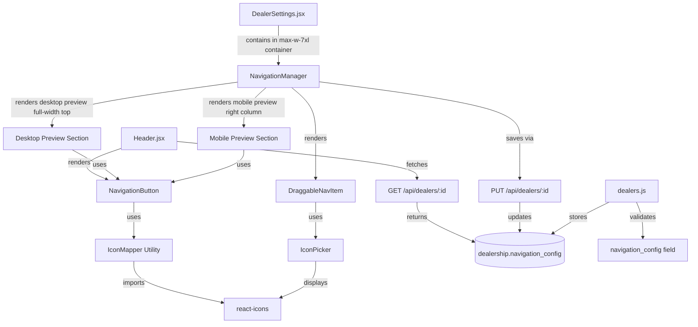

# Navigation Button Enhancement - Brownfield Architecture

**Version:** 1.0
**Date:** 2025-12-01
**Status:** Draft
**Enhancement Type:** UI/UX + CMS Feature Addition

---

## Introduction

This document outlines the architectural approach for enhancing the Multi-Dealership Car Website Platform with configurable navigation buttons featuring icons and customizable text. The enhancement integrates seamlessly with the existing system architecture while extending dealership customization capabilities.

**Relationship to Existing Architecture:**
This document supplements the existing fullstack architecture by defining how navigation customization components will integrate with current dealership management, theme systems, and frontend component patterns.

### Existing Project Analysis

**Current Project State:**
- **Primary Purpose:** Multi-tenant dealership website platform with integrated CMS for vehicle inventory management and lead capture
- **Current Tech Stack:** React 18+, React Router v6, Tailwind CSS, Node.js/Express, PostgreSQL, Cloudinary
- **Architecture Style:** Monolithic full-stack (backend serves built React frontend)
- **Deployment Method:** Railway/Render with PostgreSQL add-on, unified deployment

**Available Documentation:**
- `docs/prd.md` - Comprehensive PRD with 3 epics, 21 stories covering full platform functionality
- `docs/epic-navigation-button-enhancement.md` - Brownfield epic defining this enhancement
- Database schema defined in PRD (dealership, vehicle, lead tables)
- Existing theme customization system (theme_color field, CSS custom properties)
- Existing font customization system (font_family field)

**Identified Constraints:**
- Must maintain existing route structure (/, /inventory, /about, /finance, /warranty, /admin/login)
- Must preserve responsive mobile menu functionality
- Must remain compatible with existing theme color and font customization
- Must run on free tier infrastructure (Railway/Render, PostgreSQL, Cloudinary)
- JSONB field compatibility with PostgreSQL version in use
- No additional API calls beyond existing dealership fetch
- Must support existing multi-tenant architecture (dealershipId filtering)

---

## Enhancement Scope and Integration Strategy

### Enhancement Overview

**Enhancement Type:** UI/UX Customization Feature (Frontend + Backend + Database)
**Scope:** Add configurable navigation with icons and text management via CMS
**Integration Impact:** Low to Medium (extends existing customization patterns, no breaking changes)

### Integration Approach

**Code Integration Strategy:**
- Extend existing dealership customization pattern (follows theme_color, font_family precedent)
- New NavigationButton component integrates with Header.jsx (isolated, non-breaking)
- NavigationManager component added to existing DealerSettings.jsx admin page
- No modifications to existing components beyond Header.jsx extension

**Database Integration:**
- Add `navigation_config` JSONB column to existing `dealership` table
- Nullable field with default NULL (backwards compatible)
- Follows existing pattern of `theme_color` and `font_family` fields
- No foreign key relationships (self-contained JSON structure)

**API Integration:**
- Leverage existing `GET /api/dealers/:id` endpoint (returns new field automatically)
- Leverage existing `PUT /api/dealers/:id` endpoint (dynamic field update already supported)
- Add validation middleware for `navigation_config` structure
- No new endpoints required

**UI Integration:**
- Header.jsx modified to render NavigationButton components instead of Link components
- DealerSettings.jsx extended with new NavigationManager section
- Theme color system applied to buttons via existing CSS custom properties
- Responsive design patterns maintained (desktop + mobile hamburger menu)

### Compatibility Requirements

- **Existing API Compatibility:** ✅ No breaking changes - new field is optional, existing endpoints return it automatically
- **Database Schema Compatibility:** ✅ JSONB field is nullable, existing dealerships work with NULL (fallback to defaults)
- **UI/UX Consistency:** ✅ Follows existing DealerSettings patterns, uses existing theme system
- **Performance Impact:** ✅ Minimal - navigation config loaded with dealership data (no additional fetch)

---

## Tech Stack

### Existing Technology Stack

| Category | Current Technology | Version | Usage in Enhancement | Notes |
|----------|-------------------|---------|---------------------|-------|
| Frontend Framework | React | 18+ | Render navigation components | Functional components, hooks |
| Routing | React Router | v6 | Link components for navigation | Existing routes unchanged |
| Styling | Tailwind CSS | Latest | Button styling, responsive design | Utility classes + custom CSS |
| Backend Runtime | Node.js | 18+ LTS | Run Express server | No changes |
| Backend Framework | Express | Latest | Serve API endpoints | Existing endpoints reused |
| Database | PostgreSQL | 14+ | Store navigation_config JSONB | JSONB support required |
| Database Client | pg (node-postgres) | Latest | Query database | Parameterized queries |
| State Management | React Context | Built-in | AdminContext, DealershipContext | Existing contexts reused |
| HTTP Client | fetch API | Built-in | API calls from frontend | No changes |

### New Technology Additions

| Technology | Version | Purpose | Rationale | Integration Method |
|------------|---------|---------|-----------|-------------------|
| react-icons | ^5.0.0 | Icon library for navigation buttons | Large icon collection, tree-shakeable, widely used | npm install, import specific icons |
| @hello-pangea/dnd | ^16.0.0 | Drag-and-drop for reordering nav items | Fork of react-beautiful-dnd (actively maintained), accessible | npm install, wrap nav items in DragDropContext |

**Justification for New Libraries:**
- **react-icons:** Essential for icon display; provides 10,000+ icons from popular sets (FontAwesome, Material Icons, etc.), zero-config setup, TypeScript support
- **@hello-pangea/dnd:** Best-in-class drag-and-drop UX for reordering navigation; accessible, mobile-friendly, actively maintained (react-beautiful-dnd fork)

---

## Data Models and Schema Changes

### New Data Models

#### Navigation Configuration (Embedded in Dealership)

**Purpose:** Store customizable navigation structure with icons, labels, routes, and ordering

**Integration:** Embedded as JSONB field in existing `dealership` table (denormalized for performance)

**Structure:**
```json
{
  "navigation_config": [
    {
      "id": "home",
      "label": "Home",
      "route": "/",
      "icon": "FaHome",
      "order": 1,
      "enabled": true,
      "showIcon": true
    },
    {
      "id": "inventory",
      "label": "Inventory",
      "route": "/inventory",
      "icon": "FaCar",
      "order": 2,
      "enabled": true,
      "showIcon": true
    }
  ]
}
```

**Key Attributes:**
- `id` (string, unique): Identifier for navigation item (e.g., "home", "inventory")
- `label` (string, required): Display text for button (e.g., "Home", "Browse Cars")
- `route` (string, required): React Router path (e.g., "/", "/inventory")
- `icon` (string, required): react-icons component name (e.g., "FaHome", "FaCar")
- `order` (integer, required): Display order (1-based index)
- `enabled` (boolean, required): Toggle visibility of nav item
- `showIcon` (boolean, optional, default: true) **[ADDED 2025-12-03]**: Controls icon visibility (text always shows)

**Relationships:**
- **With Existing:** Part of `dealership` table (one-to-one embedded relationship)
- **With New:** None (self-contained structure)

### Schema Integration Strategy

**Database Changes Required:**

**Modified Tables:**
```sql
ALTER TABLE dealership
ADD COLUMN navigation_config JSONB DEFAULT NULL;
```

**Migration Strategy:**
1. Add `navigation_config` column as nullable JSONB
2. Existing dealerships will have `NULL` value (backwards compatible)
3. Seed existing dealerships with default navigation configuration via UPDATE statement
4. Frontend handles `NULL` gracefully with fallback to hardcoded defaults

**Default Navigation Configuration:**
```json
[
  { "id": "home", "label": "Home", "route": "/", "icon": "FaHome", "order": 1, "enabled": true, "showIcon": true },
  { "id": "inventory", "label": "Inventory", "route": "/inventory", "icon": "FaCar", "order": 2, "enabled": true, "showIcon": true },
  { "id": "about", "label": "About", "route": "/about", "icon": "FaInfoCircle", "order": 3, "enabled": true, "showIcon": true },
  { "id": "finance", "label": "Finance", "route": "/finance", "icon": "FaMoneyBillWave", "order": 4, "enabled": true, "showIcon": true },
  { "id": "warranty", "label": "Warranty", "route": "/warranty", "icon": "FaShieldAlt", "order": 5, "enabled": true, "showIcon": true },
  { "id": "login", "label": "Log In", "route": "/admin/login", "icon": "FaSignInAlt", "order": 6, "enabled": true, "showIcon": true }
]
```

**New Indexes:** None required (navigation config queried as part of dealership fetch)

**Backward Compatibility:**
- Column is nullable - existing queries work unchanged
- Frontend checks for `NULL` and uses default navigation
- API returns `navigation_config: null` for dealerships without customization
- No migration rollback needed (column can remain if feature rolled back)

---

## Component Architecture

### New Components

#### 1. NavigationButton (Frontend Component)

**Responsibility:** Render individual navigation button with icon and text, applying theme color styling

**Integration Points:**
- Imported by `Header.jsx` (replaces `<Link>` components)
- Receives props: `label`, `route`, `icon` (string name), `themeColor`
- Uses `react-router-dom` Link for routing
- Uses `react-icons` to render icon from string name

**Key Interfaces:**
```tsx
interface NavigationButtonProps {
  label: string;           // Display text
  route: string;           // React Router path
  icon: string;            // Icon name (e.g., "FaHome")
  showIcon?: boolean;      // Whether to display icon (default: true) [ADDED 2025-12-03]
  isMobile?: boolean;      // Mobile styling variant
}
```

**Dependencies:**
- **Existing Components:** None (standalone)
- **New Components:** IconMapper utility
- **External:** react-router-dom (Link), react-icons

**Technology Stack:** React functional component, Tailwind CSS, TypeScript (optional)

---

#### 2. IconMapper Utility (Frontend Utility)

**Responsibility:** Map icon name strings to React icon components

**Integration Points:**
- Used by NavigationButton component
- Provides fallback icon (FaCircle) if icon name not found

**Key Interfaces:**
```tsx
function getIconComponent(iconName: string): IconType {
  const iconMap = {
    'FaHome': FaHome,
    'FaCar': FaCar,
    'FaInfoCircle': FaInfoCircle,
    // ... all supported icons
  };
  return iconMap[iconName] || FaCircle; // Fallback
}
```

**Dependencies:**
- **Existing Components:** None
- **New Components:** None
- **External:** react-icons (FaHome, FaCar, etc.)

---

#### 3. NavigationManager (Admin Component)

**Responsibility:** Admin UI for managing navigation items - drag-and-drop reordering, icon picker, label editing, enable/disable toggles with improved layout for better visibility

**Integration Points:**
- Integrated into `DealerSettings.jsx` within a `max-w-7xl` container (wider than basic settings)
- Uses AdminContext for selectedDealership
- Calls existing `PUT /api/dealers/:id` endpoint to save changes
- Provides inline live previews (desktop full-width top, mobile right column bottom)

**Layout Structure:**
- **Desktop Preview Section:** Full-width at top showing all enabled navigation buttons with theme color
- **Bottom Grid:** Two-column layout (left: navigation items list with drag-and-drop, right: mobile preview)
- **Action Buttons:** Reset and Save buttons at bottom

**Key Interfaces:**
```tsx
interface NavigationManagerProps {
  dealership: Dealership;           // Current dealership
  onSave: () => void;                // Callback to refresh dealership data
}

interface NavItem {
  id: string;
  label: string;
  route: string;
  icon: string;
  order: number;
  enabled: boolean;
  showIcon?: boolean;      // [ADDED 2025-12-03] Controls icon visibility
}
```

**Dependencies:**
- **Existing Components:** AdminContext, DealerSettings save flow
- **New Components:** IconPicker, DraggableNavItem, NavigationButton (for previews)
- **External:** @hello-pangea/dnd (DragDropContext, Droppable, Draggable)

---

#### 4. IconPicker (Admin Component)

**Responsibility:** Searchable icon picker for selecting navigation icons

**Integration Points:**
- Used by NavigationManager for each nav item
- Displays icon grid with search filter
- Returns selected icon name string

**Key Interfaces:**
```tsx
interface IconPickerProps {
  currentIcon: string;              // Currently selected icon
  onSelect: (iconName: string) => void;  // Selection handler
}
```

**Dependencies:**
- **Existing Components:** None
- **New Components:** None
- **External:** react-icons (icon display)

---

#### 5. DraggableNavItem (Admin Component)

**Responsibility:** Draggable list item representing a navigation item in the manager

**Integration Points:**
- Used by NavigationManager for each nav item
- Wraps nav item data with drag-and-drop functionality
- Includes IconPicker, text input, enable toggle

**Key Interfaces:**
```tsx
interface DraggableNavItemProps {
  item: NavItem;
  index: number;
  onUpdate: (id: string, updates: Partial<NavItem>) => void;
  onDelete?: (id: string) => void;
}
```

**Dependencies:**
- **Existing Components:** None
- **New Components:** IconPicker
- **External:** @hello-pangea/dnd (Draggable)

---

### Component Interaction Diagram



---

## API Design and Integration

### API Integration Strategy

**API Integration Strategy:** Extend existing dealership endpoints with navigation_config field support (no new endpoints)

**Authentication:** Existing session-based auth for PUT endpoint (admin only)

**Versioning:** Not required (additive change, backwards compatible)

### Existing Endpoints Enhanced

#### GET /api/dealers/:id

**No changes required** - endpoint automatically returns `navigation_config` field when present

**Example Response:**
```json
{
  "id": 1,
  "name": "Acme Auto Sales",
  "theme_color": "#3B82F6",
  "font_family": "Arial, sans-serif",
  "navigation_config": [
    {
      "id": "home",
      "label": "Home",
      "route": "/",
      "icon": "FaHome",
      "order": 1,
      "enabled": true,
      "showIcon": true
    }
  ],
  ...
}
```

If `navigation_config` is NULL:
```json
{
  "id": 1,
  "name": "Acme Auto Sales",
  "navigation_config": null,
  ...
}
```

#### PUT /api/dealers/:id

**Enhanced with validation middleware for navigation_config**

**Validation Rules:**
- `navigation_config` must be array or null
- Each item must have: `id`, `label`, `route`, `icon`, `order`, `enabled`
- Optional field: `showIcon` (boolean, if present must be boolean type) **[ADDED 2025-12-03]**
- `id` must be unique within array
- `route` must be valid path string
- `icon` must be non-empty string
- `order` must be positive integer
- `enabled` must be boolean

**Request:**
```json
{
  "navigation_config": [
    {
      "id": "home",
      "label": "Welcome",
      "route": "/",
      "icon": "FaHome",
      "order": 1,
      "enabled": true,
      "showIcon": false
    }
  ]
}
```

**Response (Success - 200):**
```json
{
  "id": 1,
  "name": "Acme Auto Sales",
  "navigation_config": [
    {
      "id": "home",
      "label": "Welcome",
      "route": "/",
      "icon": "FaHome",
      "order": 1,
      "enabled": true,
      "showIcon": false
    }
  ],
  ...
}
```

**Response (Validation Error - 400):**
```json
{
  "error": "Invalid navigation_config: each item must have id, label, route, icon, order, enabled"
}
```

---

## Source Tree

### Existing Project Structure (Relevant Parts)

```
backend/
├── db/
│   ├── index.js              # Existing - database connection pool
│   ├── dealers.js            # Modified - add navigation_config field support
│   └── migrations/
│       └── run_migration.js  # Existing - migration runner
├── routes/
│   └── dealers.js            # Modified - add validation middleware
└── server.js                 # Existing - no changes

frontend/
├── src/
│   ├── components/
│   │   ├── Header.jsx        # Modified - use NavigationButton components
│   │   └── AdminHeader.jsx   # Existing - no changes
│   ├── pages/
│   │   └── admin/
│   │       └── DealerSettings.jsx  # Modified - add NavigationManager section
│   ├── context/
│   │   └── DealershipContext.jsx   # Existing - no changes
│   └── hooks/
│       └── useDealership.js   # Existing - no changes
```

### New File Organization

```
JealPrototypeTest/
├── backend/
│   ├── db/
│   │   ├── dealers.js                # MODIFIED - add navigation_config handling
│   │   └── migrations/
│   │       └── 004_add_navigation_config.sql  # NEW - database migration
│   └── routes/
│       └── dealers.js                 # MODIFIED - add validation middleware
├── frontend/
│   └── src/
│       ├── components/
│       │   ├── Header.jsx             # MODIFIED - use NavigationButton
│       │   ├── NavigationButton.jsx   # NEW - navigation button with icon
│       │   └── admin/
│       │       ├── NavigationManager.jsx  # NEW - admin nav management UI with improved layout
│       │       ├── IconPicker.jsx         # NEW - icon selection component
│       │       └── DraggableNavItem.jsx   # NEW - draggable nav item
│       ├── pages/
│       │   └── admin/
│       │       └── DealerSettings.jsx      # MODIFIED - split layout: max-w-3xl basic settings, max-w-7xl Navigation Manager
│       └── utils/
│           ├── iconMapper.js          # NEW - map icon names to components
│           └── defaultNavigation.js   # NEW - default nav config constant
└── docs/
    ├── epic-navigation-button-enhancement.md  # NEW - epic document
    └── architecture-navigation-enhancement.md # NEW - this architecture doc (updated with layout improvements)
```

**Layout Changes Summary:**
- DealerSettings.jsx now uses two separate containers with different max-widths
- Basic settings (theme color, font, logo, etc.) use `max-w-3xl` for focused layout
- Navigation Manager uses `max-w-7xl` for wider workspace and better preview visibility
- NavigationManager component embeds previews directly (desktop full-width top, mobile right column)
- NavPreview.jsx component is deprecated/unused (replaced by inline preview sections)

### Integration Guidelines

- **File Naming:** Follow existing conventions - PascalCase for React components (.jsx), camelCase for utilities (.js)
- **Folder Organization:** Admin components in `frontend/src/components/admin/`, utilities in `frontend/src/utils/`
- **Import/Export Patterns:** Named exports for utilities, default exports for React components (existing pattern)

---

## Infrastructure and Deployment Integration

### Existing Infrastructure

**Current Deployment:** Railway (primary) or Render with unified backend+frontend deployment, PostgreSQL add-on
**Infrastructure Tools:** Git-based auto-deploy, environment variables via platform UI
**Environments:** Single production environment (no staging for MVP)

### Enhancement Deployment Strategy

**Deployment Approach:**
1. Run database migration (`004_add_navigation_config.sql`) via backend startup script or manual execution
2. Deploy backend changes (dealers.js, validation middleware)
3. Deploy frontend changes (new components, updated Header.jsx)
4. No environment variable changes required
5. No infrastructure changes required (works within existing free tier)

**Infrastructure Changes:** None - enhancement fits within existing monolithic architecture

**Pipeline Integration:**
- Standard git push to `main` branch triggers auto-deploy
- Migration runs on backend startup (or manually via Railway/Render console)
- Frontend build process includes new components automatically
- No additional build steps required

### Rollback Strategy

**Rollback Method:**
1. Git revert commits (frontend and backend changes)
2. Redeploy previous version via Railway/Render
3. Database migration rollback: `ALTER TABLE dealership DROP COLUMN navigation_config;` (optional - column can remain)

**Risk Mitigation:**
- Database column is nullable - existing dealerships work without customization
- Frontend fallback to hardcoded navigation if config is null/invalid
- No breaking changes to existing APIs or routes
- Isolated changes minimize blast radius

**Monitoring:**
- Railway/Render logs for deployment errors
- Browser console errors for frontend issues
- PostgreSQL logs for database errors
- Manual testing of navigation on both dealerships post-deployment

---

## Coding Standards

### Existing Standards Compliance

**Code Style:** Functional React components with hooks, Tailwind CSS utility classes, ES6+ JavaScript
**Linting Rules:** Standard ESLint config (no custom rules enforced in MVP)
**Testing Patterns:** Manual testing only for MVP (no automated test suite)
**Documentation Style:** JSDoc comments for component props, inline comments for complex logic

### Enhancement-Specific Standards

- **Icon Naming Convention:** Use react-icons component names as strings (e.g., "FaHome", "FaCar") for consistency
- **Navigation Config Validation:** Always validate navigation_config structure on backend before saving
- **Fallback Strategy:** Frontend must always handle `null` or invalid navigation_config gracefully
- **Accessibility:** All navigation buttons must have proper ARIA labels and keyboard navigation support

### Critical Integration Rules

- **Existing API Compatibility:** Never remove or rename existing dealership fields - only add navigation_config
- **Database Integration:** Use parameterized queries for all database operations (SQL injection prevention)
- **Error Handling:** Display user-friendly error messages in admin UI, log detailed errors to backend console
- **Logging Consistency:** Use `console.error()` for errors, `console.log()` for success messages (existing pattern)

---

## Testing Strategy

### Integration with Existing Tests

**Existing Test Framework:** Manual testing only (no automated test suite for MVP)
**Test Organization:** Manual test checklist executed post-deployment
**Coverage Requirements:** All user journeys tested manually (public website browsing, admin management)

### New Testing Requirements

#### Unit Tests for New Components

- **Framework:** Manual component testing in browser (no automated unit tests for MVP)
- **Location:** Test in local development environment before deployment
- **Coverage Target:** All new components (NavigationButton, NavigationManager, IconPicker) tested manually
- **Integration with Existing:** Verify Header.jsx still works with existing dealerships (null navigation_config)

#### Integration Tests

**Scope:**
1. End-to-end admin flow: Login → Select dealership → Edit navigation → Save → Verify on public site
2. Public site navigation: Click all nav buttons → Verify routes work → Test mobile menu
3. Theme color integration: Change theme color → Verify navigation buttons update
4. Backwards compatibility: Test dealership with null navigation_config → Verify defaults work

**Existing System Verification:**
- Verify all existing navigation routes still work (/, /inventory, /about, /finance, /warranty, /admin/login)
- Verify mobile hamburger menu still opens/closes correctly
- Verify theme color customization still works
- Verify font customization still works

**New Feature Testing:**
- Verify navigation config saves to database correctly
- Verify icons display correctly from icon names
- Verify drag-and-drop reordering works
- Verify enable/disable toggles work
- Verify live preview updates in real-time

#### Regression Testing

**Existing Feature Verification:**
- Test vehicle listing page (verify header navigation still works)
- Test vehicle detail page (verify enquiry form still works)
- Test admin vehicle manager (verify CRUD operations still work)
- Test dealership settings (verify existing customizations still work)

**Automated Regression Suite:** None for MVP

**Manual Testing Requirements:**
1. Test both dealerships (Acme Auto Sales, Premier Motors) with different navigation configs
2. Test on desktop (Chrome, Firefox, Safari)
3. Test on mobile (iPhone Safari, Android Chrome)
4. Test tablet (iPad)
5. Verify accessibility (keyboard navigation, screen reader)

---

## Security Integration

### Existing Security Measures

**Authentication:** Session-based auth with httpOnly cookies, login via POST /api/auth/login
**Authorization:** Admin routes protected by authentication middleware
**Data Protection:** HTTPS (platform-provided), parameterized SQL queries (SQL injection prevention)
**Security Tools:** None (no OWASP ZAP, Snyk, etc. for MVP)

### Enhancement Security Requirements

**New Security Measures:**
- Validate navigation_config structure on backend (prevent XSS via malicious route injection)
- Sanitize icon names (whitelist approach - only allow known react-icons component names)
- Validate route paths (prevent open redirect vulnerabilities)

**Integration Points:**
- Validation middleware on PUT /api/dealers/:id (validates navigation_config before save)
- Frontend sanitization (IconMapper utility provides whitelist of allowed icons)
- Route validation (ensure routes match existing React Router paths)

**Compliance Requirements:** None (no GDPR, HIPAA, SOC2 for MVP)

### Security Testing

**Existing Security Tests:** Manual testing only

**New Security Test Requirements:**
1. Attempt to inject malicious route (e.g., "javascript:alert('XSS')") → Verify validation rejects
2. Attempt to use invalid icon name → Verify fallback icon renders (no error)
3. Attempt to save navigation config with SQL injection payload → Verify parameterized queries prevent
4. Test authentication: Access PUT /api/dealers/:id without login → Verify 401 Unauthorized

**Penetration Testing:** Not required for MVP

---

## Next Steps

### Story Manager Handoff

**Handoff Prompt for Scrum Master (Bob):**

"Please create detailed user stories for the Navigation Button Enhancement epic based on:

- **Epic Document:** `docs/epic-navigation-button-enhancement.md`
- **Architecture Document:** `docs/architecture-navigation-enhancement.md`

**Key Integration Requirements Validated:**
- Existing system uses React 18, React Router v6, Tailwind CSS, Express, PostgreSQL
- Database module `backend/db/dealers.js` already supports dynamic field updates (theme_color, font_family pattern)
- API endpoint `PUT /api/dealers/:id` ready for navigation_config field
- Frontend Header.jsx uses Tailwind CSS and responsive mobile menu
- Admin DealerSettings.jsx follows theme color customization pattern (color picker, live preview, validation)

**Existing System Constraints from Project Analysis:**
- Must maintain existing routes (/, /inventory, /about, /finance, /warranty, /admin/login)
- Must preserve mobile hamburger menu functionality (lines 116-175 in Header.jsx)
- Must use existing theme color system (CSS custom properties: --theme-primary)
- Must follow existing admin form patterns (validation, success messages, error handling)
- Must handle null navigation_config gracefully (backwards compatibility)

**First Story to Implement:**
Start with **Story 1: Database Schema & Backend API** to establish data layer, then **Story 3: Public Header** (user-visible feature), then **Story 2: Admin CMS** (management interface).

**Integration Checkpoints:**
- After Story 1: Test API with Postman, verify null handling
- After Story 2: Test admin UI with both dealerships, verify save flow
- After Story 3: Test public header on desktop + mobile, verify theme colors

**Critical:** Each story must verify existing functionality remains intact (routing, mobile menu, theme colors, responsiveness)."

### Developer Handoff

**Handoff Prompt for Developer (James):**

"Implement the Navigation Button Enhancement feature based on:

- **Epic:** `docs/epic-navigation-button-enhancement.md`
- **Architecture:** `docs/architecture-navigation-enhancement.md`
- **Existing Coding Standards:** Functional React components, Tailwind CSS, JSDoc comments, parameterized SQL queries

**Key Technical Decisions from Project Constraints:**
1. Use JSONB column for `navigation_config` (PostgreSQL 14+ supports it)
2. Use react-icons library (tree-shakeable, 10,000+ icons)
3. Use @hello-pangea/dnd for drag-and-drop (accessible, maintained fork of react-beautiful-dnd)
4. Extend existing `dealers.js update()` function (dynamic field pattern already exists)
5. Follow theme color pattern (CSS custom properties, live preview)

**Existing System Compatibility Requirements:**
- DO NOT modify existing routes or React Router configuration
- DO NOT break mobile hamburger menu (lines 116-175 in Header.jsx)
- DO NOT remove existing dealership fields (theme_color, font_family)
- DO verify Header.jsx works with `navigation_config: null` (fallback to defaults)
- DO test with both dealerships in local database

**Implementation Sequence (Minimizes Risk):**
1. Story 1: Database + API (foundation, testable with Postman)
2. Story 3: Public Header (user-visible, immediate value)
3. Story 2: Admin UI (management interface, builds on working header)

**Verification Steps (Per Story):**
- Story 1: Run migration, test API with curl, verify existing dealerships unchanged
- Story 2: Test admin UI, verify save flow, check database updates
- Story 3: Test desktop + mobile header, verify icons display, check theme colors

**Rollback Plan:**
- Git revert commits if issues found
- Database column can remain (nullable, backwards compatible)
- Header.jsx reverts to hardcoded links if needed

Start with Story 1 and HALT for review before proceeding to Story 2."

---

**End of Architecture Document**
