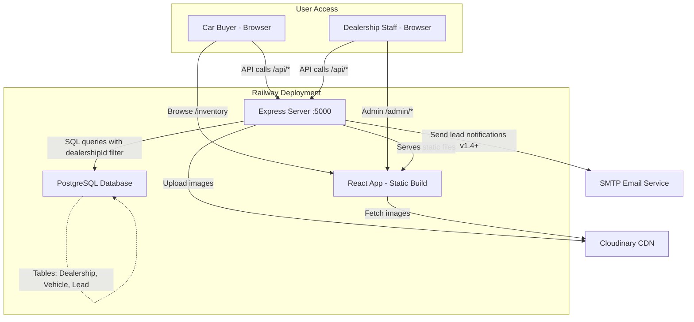

# 2. High Level Architecture

## Technical Summary

**JealPrototypeTest** is a monolithic full-stack application with multi-tenant data architecture. The backend is a Node.js/Express REST API serving both API endpoints and the built React frontend as static files. PostgreSQL provides relational storage with `dealershipId` foreign keys enforcing tenant isolation. Cloudinary handles all image uploads via its upload widget (frontend) and transformation API (CDN delivery). The application deploys as a single service to Railway or Render, with database and environment variables configured via platform add-ons. This architecture achieves the PRD goal of rapid 2-day development by eliminating microservices complexity, separate frontend hosting, and custom image infrastructure—while maintaining production viability for 2-5 small dealerships (~50 vehicles each).

## Platform and Infrastructure Choice

**Platform:** Railway (primary) or Render (fallback)

**Key Services:**
- **Compute:** Railway web service (free tier: 500 hours/month, $5 credit) running Node.js app
- **Database:** Railway PostgreSQL plugin (free tier: 1GB storage, 1GB RAM)
- **CDN/Storage:** Cloudinary (free tier: 25GB storage, 25GB bandwidth/month)
- **SSL/Domain:** Railway-provided HTTPS domain (`*.up.railway.app`)

**Deployment Host and Regions:** Railway US region (auto-assigned), Cloudinary US datacenter

**Decision Rationale:**
- **Railway over Render:** Simpler Git-based deploys, PostgreSQL plugin auto-wires `DATABASE_URL`, generous free tier
- **Railway over Vercel/Netlify:** Need unified backend+frontend hosting; Vercel/Netlify serverless functions add complexity
- **PostgreSQL over MongoDB:** Relational model enforces referential integrity for multi-tenancy (foreign keys prevent orphaned vehicles/leads)
- **Cloudinary over S3/local storage:** Upload widget eliminates file handling code, auto-optimization (WebP, resizing) is free, CDN included

**Fallback Plan:** If Railway free tier exhausted, migrate to Render (identical architecture, different platform config)

## Repository Structure

**Structure:** Monorepo with `/backend` and `/frontend` workspaces

**Monorepo Tool:** npm workspaces (lightweight, no additional dependencies)

**Package Organization:**
```
/
├── backend/              # Express API server
│   ├── package.json
│   ├── server.js         # Entry point
│   ├── routes/           # API route handlers
│   ├── db/              # Database queries
│   ├── services/         # Email notifications (v1.4+)
│   └── middleware/       # Auth, error handling
├── frontend/             # React app
│   ├── package.json
│   ├── src/
│   │   ├── public/      # Public site components
│   │   ├── admin/       # Admin CMS components
│   │   └── shared/      # Shared utilities
│   └── dist/            # Production build output
├── package.json          # Root workspace config
└── .env                 # Local dev environment vars
```

**Rationale:** Simple two-package structure matches PRD requirements. Root `package.json` scripts run both servers concurrently in dev (`npm run dev`). Backend serves `frontend/dist` in production via `express.static()`. No shared code packages needed—API is the contract between frontend and backend.

## High Level Architecture Diagram



**Key Data Flows:**
1. **Public visitor:** Browser → React app (static) → API calls → Express → PostgreSQL → JSON response → React renders
2. **Image upload (admin):** Cloudinary widget → direct upload to Cloudinary → URL returned → React → API → save URL to PostgreSQL
3. **Lead notification (v1.4+):** Customer submits enquiry → API creates lead → PostgreSQL → Email service (async) → SMTP server → Dealership inbox
4. **Multi-tenancy:** All API queries include `WHERE dealership_id = ?` filter

## Architectural Patterns

- **Monolithic Architecture:** Single deployment containing API and frontend - _Rationale:_ Fastest path to production; sufficient for 2-5 dealerships with <100 vehicles each; avoids CORS, service orchestration, and deployment coordination overhead

- **REST API:** JSON-based HTTP endpoints following RESTful conventions - _Rationale:_ Universally understood, simple to test (Postman/curl), no additional transport layer (vs GraphQL/tRPC); PRD explicitly specifies REST

- **Repository Pattern (Backend):** Abstract database queries into `db/` modules (e.g., `db/vehicles.js` exports `getAllVehicles(dealershipId)`) - _Rationale:_ Centralizes `dealershipId` filtering logic, enables unit testing of business logic separate from SQL, simplifies migration to ORM later if needed

- **Multi-Tenant Data Isolation:** All tables include `dealership_id` foreign key; all queries filter by dealership context - _Rationale:_ Shared database with row-level filtering is simplest multi-tenancy model for small scale; avoids schema-per-tenant or database-per-tenant complexity

- **Client-Side Routing (React Router):** React Router handles `/`, `/inventory`, `/admin/*` routes - _Rationale:_ SPA navigation without page reloads; backend serves `index.html` for all non-API routes (catch-all)

- **Stateless API:** No server-side sessions; admin auth uses simple JWT or session cookie - _Rationale:_ Enables horizontal scaling later (though not needed for MVP); simplifies backend logic

- **Cloudinary Direct Upload:** Frontend uploads images directly to Cloudinary (signed upload widget) - _Rationale:_ Offloads image processing from backend; reduces backend bandwidth; Cloudinary widget handles progress, retries, validation

---
