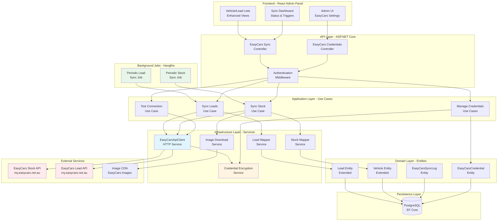
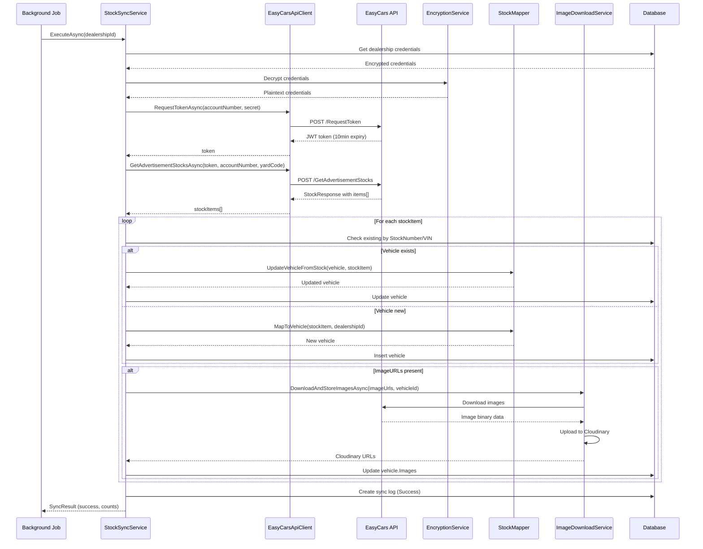
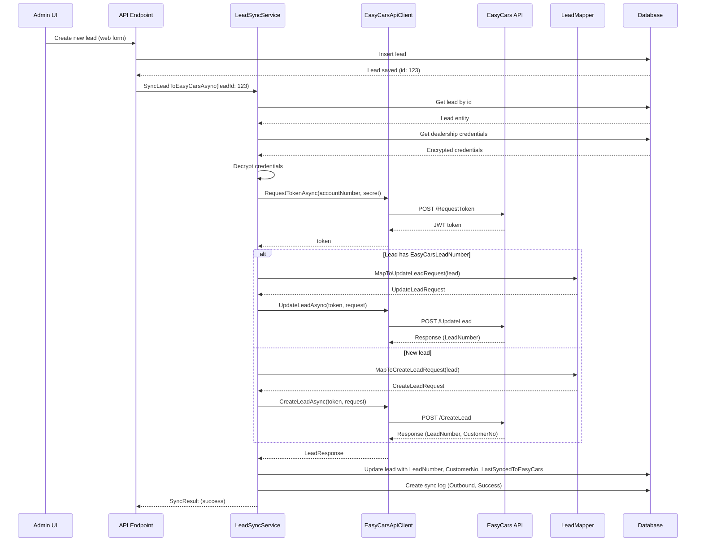
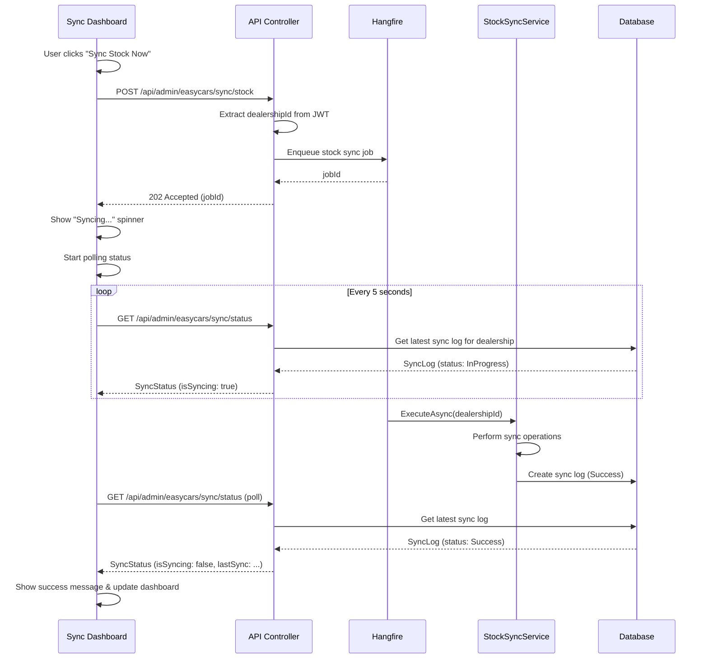
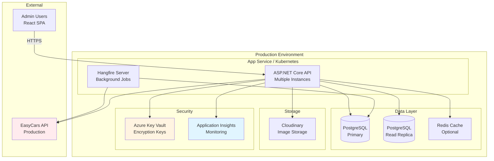

# EasyCars API Integration Architecture Document

## Introduction

This document outlines the complete technical architecture for the EasyCars API Integration feature in the JealPrototype dealership management system. It serves as the authoritative guide for implementing bi-directional synchronization between dealership inventory/lead systems and the EasyCars platform, ensuring data consistency, security, and reliability across multiple tenants.

The architecture follows Clean Architecture principles established in the existing .NET 8 backend, extending it with new domain entities, application use cases, infrastructure services, and API endpoints specifically for EasyCars integration. The frontend React admin panel will be enhanced to provide credential management and synchronization monitoring capabilities.

### Architectural Context

This is a **brownfield integration** into an existing multi-tenant dealership management system with:
- **.NET 8 Backend**: Clean Architecture (Domain → Application → Infrastructure → API layers)
- **React Frontend**: Admin panel with TypeScript
- **PostgreSQL Database**: Entity Framework Core with migrations
- **Multi-Tenant Architecture**: Dealership-level data isolation
- **RESTful API**: JWT-based authentication

### Change Log

| Date | Version | Description | Author |
|------|---------|-------------|--------|
| 2025-01-15 | 1.0 | Initial architecture document for EasyCars integration | Winston (BMad Architect) |

---

## High Level Architecture

### Technical Summary

The EasyCars API Integration extends the existing monolithic .NET 8 application with a dedicated integration layer that manages bi-directional data synchronization between dealerships and the EasyCars platform. The architecture implements a background service pattern using Hangfire for scheduled synchronization jobs, HttpClient-based services for API communication with automatic JWT token management, and encrypted credential storage using AES-256-GCM encryption. Data flows through a mapping layer that transforms between EasyCars API models and domain entities, with comprehensive audit logging and idempotent sync operations to handle failures gracefully. The frontend React admin panel provides dealership administrators with secure credential management, manual sync triggers, and real-time synchronization status monitoring. This architecture maintains backward compatibility with existing vehicle and lead management features while enabling seamless integration with EasyCars Stock API and Lead API endpoints.

### Architecture Diagram



### Architectural Patterns

The EasyCars integration follows established architectural patterns to ensure maintainability, testability, and scalability:

- **Clean Architecture (Domain-Centric):** Maintains strict dependency rules with Domain at the center, Application layer orchestrating use cases, Infrastructure implementing external concerns, and API exposing HTTP endpoints - _Rationale:_ Ensures business logic independence from infrastructure concerns and enables comprehensive testing

- **Repository Pattern:** Abstracts data access through repository interfaces defined in Application layer and implemented in Infrastructure - _Rationale:_ Provides flexibility for data access strategy changes and enables unit testing with mocked repositories

- **Background Job Pattern (Hangfire):** Executes long-running synchronization operations outside the HTTP request pipeline with persistence, retry logic, and monitoring - _Rationale:_ Prevents API timeouts, enables scheduled operations, and provides fault tolerance for sync jobs

- **API Client Service Pattern:** Encapsulates all EasyCars API communication in dedicated service classes with token management, error handling, and retry logic - _Rationale:_ Centralizes external API concerns, simplifies testing with mocked HTTP clients, and ensures consistent error handling

- **Data Mapper Pattern:** Transforms between external API models and domain entities through dedicated mapper services - _Rationale:_ Decouples domain model from external API structure, enabling independent evolution and comprehensive data validation

- **Encryption-at-Rest Pattern:** Encrypts sensitive credentials using AES-256-GCM before database storage with secure key management - _Rationale:_ Protects sensitive dealer credentials from database breaches and meets security compliance requirements

- **Audit Log Pattern:** Records all synchronization operations with timestamps, results, and error details for traceability - _Rationale:_ Enables troubleshooting, compliance auditing, and operational monitoring of integration health

- **Idempotent Operations Pattern:** Ensures sync operations can safely execute multiple times with same result - _Rationale:_ Handles retry scenarios, prevents duplicate data creation, and supports eventual consistency

---

## Tech Stack

### Technology Stack for EasyCars Integration

| Category | Technology | Version | Purpose | Rationale |
|----------|-----------|---------|---------|-----------|
| Backend Language | C# | 12.0 (.NET 8) | EasyCars integration backend services | Existing system standard, mature ecosystem for enterprise integrations |
| Backend Framework | ASP.NET Core | 8.0 | REST API endpoints for credentials and sync | High performance, cross-platform, established in codebase |
| ORM | Entity Framework Core | 8.0 | Database access and migrations | Existing data access layer, strong migration support |
| Database | PostgreSQL | 15+ | Persistent storage for credentials and sync data | Existing database, ACID compliance, JSON support for API payloads |
| HTTP Client | HttpClient | .NET 8 | EasyCars API communication | Built-in, supports IHttpClientFactory for resilience |
| Background Jobs | Hangfire | 1.8+ | Scheduled and background sync operations | Persistent job storage, built-in retry logic, admin dashboard |
| Encryption | AES-256-GCM | .NET Cryptography | Credential encryption at rest | Industry standard, authenticated encryption prevents tampering |
| Authentication | JWT Bearer | .NET 8 Identity | Admin API authentication | Existing auth system, stateless, secure |
| Testing Framework | xUnit | 2.6+ | Unit and integration tests | Existing test framework in backend-dotnet |
| Mocking Library | Moq | 4.20+ | Mock dependencies in unit tests | Existing mocking framework, fluent API |
| Frontend Framework | React | 18+ | Admin UI for credentials and sync | Existing frontend framework |
| Frontend Language | TypeScript | 5+ | Type-safe frontend development | Existing frontend standard, catches errors at compile time |
| State Management | React Context/Hooks | React 18 | Component state and API calls | Built-in solution, sufficient for admin panel scope |
| HTTP Client (Frontend) | Axios | 1.6+ | API calls from React to backend | Existing HTTP library, interceptor support for auth |
| Logging | Serilog | 3.1+ | Structured logging for sync operations | Rich structured logging, multiple sinks support |
| Configuration | .NET Configuration | 8.0 | Environment-based settings | Built-in, supports appsettings.json and env vars |
| Code Analysis | SonarQube/Analyzer | Latest | Code quality and security scanning | Detect vulnerabilities, enforce code standards |

---

## Data Models

### Core Domain Entities

The EasyCars integration introduces new domain entities while extending existing ones to support synchronization tracking and data lineage.

#### EasyCarsCredential Entity

**Purpose:** Securely stores dealership-specific EasyCars API credentials with encryption for Account Number (PublicID) and Account Secret (SecretKey).

**Key Attributes:**
- `Id` (int, PK): Unique identifier for credential record
- `DealershipId` (int, FK): Reference to owning Dealership
- `AccountNumberEncrypted` (string): AES-256-GCM encrypted Account Number/PublicID
- `AccountSecretEncrypted` (string): AES-256-GCM encrypted Account Secret/SecretKey
- `Environment` (enum: Test, Production): Target API environment
- `IsActive` (bool): Whether credentials are currently active
- `YardCode` (string, nullable): Optional filter for specific yard inventory
- `CreatedAt` (DateTime): Credential creation timestamp
- `UpdatedAt` (DateTime): Last modification timestamp
- `LastSyncedAt` (DateTime, nullable): Last successful sync operation

**TypeScript Interface (Shared Model):**
```typescript
export interface EasyCarsCredential {
  id: number;
  dealershipId: number;
  accountNumber?: string; // Only exposed in write operations, never returned in GET
  environment: 'Test' | 'Production';
  isActive: boolean;
  yardCode?: string;
  createdAt: string; // ISO 8601
  updatedAt: string; // ISO 8601
  lastSyncedAt?: string; // ISO 8601
}

export interface EasyCarsCredentialRequest {
  accountNumber: string;
  accountSecret: string;
  environment: 'Test' | 'Production';
  yardCode?: string;
}
```

**Relationships:**
- Belongs to one Dealership (Many-to-One)
- Has many EasyCarsSyncLog entries (One-to-Many)

---

#### EasyCarsSyncLog Entity

**Purpose:** Audit trail for all synchronization operations tracking success, failures, performance metrics, and detailed error information.

**Key Attributes:**
- `Id` (int, PK): Unique log entry identifier
- `DealershipId` (int, FK): Dealership that triggered sync
- `CredentialId` (int, FK, nullable): Credential used for sync
- `SyncType` (enum: Stock, Lead): Type of synchronization
- `SyncDirection` (enum: Inbound, Outbound): Data flow direction
- `Status` (enum: Success, Failed, Warning, InProgress): Sync result
- `StartedAt` (DateTime): Sync operation start time
- `CompletedAt` (DateTime, nullable): Sync completion time
- `RecordsProcessed` (int): Number of records handled
- `RecordsCreated` (int): New records created
- `RecordsUpdated` (int): Existing records updated
- `RecordsFailed` (int): Records that failed to process
- `ErrorMessage` (string, nullable): Summary error message if failed
- `ErrorDetails` (string, nullable): Detailed error information and stack trace
- `RequestPayload` (JSON, nullable): API request payload for debugging
- `ResponseSummary` (JSON, nullable): API response metadata

**TypeScript Interface:**
```typescript
export interface EasyCarsSyncLog {
  id: number;
  dealershipId: number;
  syncType: 'Stock' | 'Lead';
  syncDirection: 'Inbound' | 'Outbound';
  status: 'Success' | 'Failed' | 'Warning' | 'InProgress';
  startedAt: string; // ISO 8601
  completedAt?: string; // ISO 8601
  recordsProcessed: number;
  recordsCreated: number;
  recordsUpdated: number;
  recordsFailed: number;
  errorMessage?: string;
  durationMs?: number; // Calculated: completedAt - startedAt
}

export interface SyncSummary {
  lastSync?: EasyCarsSyncLog;
  recentLogs: EasyCarsSyncLog[];
  isConfigured: boolean;
  isSyncing: boolean;
}
```

**Relationships:**
- Belongs to one Dealership (Many-to-One)
- Belongs to one EasyCarsCredential (Many-to-One, nullable)

---

#### Vehicle Entity Extensions

**Purpose:** Track EasyCars synchronization metadata and store complete API response data for vehicles.

**Extended Attributes:**
- `EasyCarsStockNumber` (string, nullable): EasyCars unique stock identifier
- `EasyCarsYardCode` (string, nullable): Yard location code from EasyCars
- `EasyCarsVIN` (string, nullable): VIN from EasyCars API
- `EasyCarsRawData` (JSON, nullable): Complete EasyCars Stock API response
- `DataSource` (enum: Manual, EasyCars, Import): Origin of vehicle data
- `LastSyncedFromEasyCars` (DateTime, nullable): Last sync timestamp
- `ExteriorColor` (string, nullable): Added from EasyCars Colour field
- `InteriorColor` (string, nullable): Added from EasyCars InteriorColor field
- `Body` (string, nullable): Body type (Sedan, SUV, etc.) from EasyCars
- `FuelType` (string, nullable): Fuel type from EasyCars
- `GearType` (string, nullable): Transmission type from EasyCars
- `EngineCapacity` (string, nullable): Engine size from EasyCars
- `DoorCount` (int, nullable): Number of doors from EasyCars
- `Features` (string[], nullable): Array of features from StandardFeatures/OptionalFeatures

**Note:** Vehicle entity already has Make, Model, Year, Price, Mileage, Condition, Status, Title, Description, Images which map naturally to EasyCars fields.

---

#### Lead Entity Extensions

**Purpose:** Track EasyCars synchronization metadata and support bi-directional lead sync.

**Extended Attributes:**
- `EasyCarsLeadNumber` (string, nullable): EasyCars unique lead identifier
- `EasyCarsCustomerNo` (string, nullable): Customer number from EasyCars
- `EasyCarsRawData` (JSON, nullable): Complete EasyCars Lead API response
- `DataSource` (enum: Manual, EasyCars, WebForm): Origin of lead data
- `LastSyncedToEasyCars` (DateTime, nullable): Last outbound sync timestamp
- `LastSyncedFromEasyCars` (DateTime, nullable): Last inbound sync timestamp
- `VehicleInterestType` (enum, nullable): Type of interest (Purchase, TradeIn, Finance, etc.)
- `FinanceInterested` (bool): Whether customer interested in financing
- `Rating` (enum, nullable): Lead quality rating (Hot, Warm, Cold)

**Note:** Lead entity already has DealershipId, VehicleId, Name, Email, Phone, Message, Status which map to EasyCars customer and lead data.

---

## Database Schema

### New Tables

#### dealership_easycars_credentials

```sql
CREATE TABLE dealership_easycars_credentials (
    id SERIAL PRIMARY KEY,
    dealership_id INTEGER NOT NULL REFERENCES dealerships(id) ON DELETE CASCADE,
    account_number_encrypted TEXT NOT NULL,
    account_secret_encrypted TEXT NOT NULL,
    encryption_iv TEXT NOT NULL, -- Initialization vector for AES-GCM
    environment VARCHAR(20) NOT NULL CHECK (environment IN ('Test', 'Production')),
    is_active BOOLEAN NOT NULL DEFAULT true,
    yard_code VARCHAR(50),
    created_at TIMESTAMP NOT NULL DEFAULT CURRENT_TIMESTAMP,
    updated_at TIMESTAMP NOT NULL DEFAULT CURRENT_TIMESTAMP,
    last_synced_at TIMESTAMP,
    CONSTRAINT uk_dealership_easycars_credential UNIQUE (dealership_id)
);

CREATE INDEX idx_easycars_credentials_dealership ON dealership_easycars_credentials(dealership_id);
CREATE INDEX idx_easycars_credentials_active ON dealership_easycars_credentials(is_active) WHERE is_active = true;
```

#### easycars_sync_logs

```sql
CREATE TABLE easycars_sync_logs (
    id SERIAL PRIMARY KEY,
    dealership_id INTEGER NOT NULL REFERENCES dealerships(id) ON DELETE CASCADE,
    credential_id INTEGER REFERENCES dealership_easycars_credentials(id) ON DELETE SET NULL,
    sync_type VARCHAR(20) NOT NULL CHECK (sync_type IN ('Stock', 'Lead')),
    sync_direction VARCHAR(20) NOT NULL CHECK (sync_direction IN ('Inbound', 'Outbound')),
    status VARCHAR(20) NOT NULL CHECK (status IN ('Success', 'Failed', 'Warning', 'InProgress')),
    started_at TIMESTAMP NOT NULL DEFAULT CURRENT_TIMESTAMP,
    completed_at TIMESTAMP,
    records_processed INTEGER NOT NULL DEFAULT 0,
    records_created INTEGER NOT NULL DEFAULT 0,
    records_updated INTEGER NOT NULL DEFAULT 0,
    records_failed INTEGER NOT NULL DEFAULT 0,
    error_message TEXT,
    error_details TEXT,
    request_payload JSONB,
    response_summary JSONB,
    CONSTRAINT chk_completed_after_started CHECK (completed_at IS NULL OR completed_at >= started_at)
);

CREATE INDEX idx_sync_logs_dealership ON easycars_sync_logs(dealership_id);
CREATE INDEX idx_sync_logs_status ON easycars_sync_logs(status);
CREATE INDEX idx_sync_logs_started_at ON easycars_sync_logs(started_at DESC);
CREATE INDEX idx_sync_logs_sync_type ON easycars_sync_logs(sync_type);
```

### Modified Tables

#### vehicles (Extended)

```sql
ALTER TABLE vehicles ADD COLUMN easycars_stock_number VARCHAR(100);
ALTER TABLE vehicles ADD COLUMN easycars_yard_code VARCHAR(50);
ALTER TABLE vehicles ADD COLUMN easycars_vin VARCHAR(17);
ALTER TABLE vehicles ADD COLUMN easycars_raw_data JSONB;
ALTER TABLE vehicles ADD COLUMN data_source VARCHAR(20) NOT NULL DEFAULT 'Manual' 
    CHECK (data_source IN ('Manual', 'EasyCars', 'Import'));
ALTER TABLE vehicles ADD COLUMN last_synced_from_easycars TIMESTAMP;
ALTER TABLE vehicles ADD COLUMN exterior_color VARCHAR(50);
ALTER TABLE vehicles ADD COLUMN interior_color VARCHAR(50);
ALTER TABLE vehicles ADD COLUMN body VARCHAR(50);
ALTER TABLE vehicles ADD COLUMN fuel_type VARCHAR(50);
ALTER TABLE vehicles ADD COLUMN gear_type VARCHAR(50);
ALTER TABLE vehicles ADD COLUMN engine_capacity VARCHAR(50);
ALTER TABLE vehicles ADD COLUMN door_count INTEGER;
ALTER TABLE vehicles ADD COLUMN features JSONB;

CREATE INDEX idx_vehicles_easycars_stock ON vehicles(easycars_stock_number) WHERE easycars_stock_number IS NOT NULL;
CREATE INDEX idx_vehicles_data_source ON vehicles(data_source);
CREATE INDEX idx_vehicles_easycars_vin ON vehicles(easycars_vin) WHERE easycars_vin IS NOT NULL;
```

#### leads (Extended)

```sql
ALTER TABLE leads ADD COLUMN easycars_lead_number VARCHAR(100);
ALTER TABLE leads ADD COLUMN easycars_customer_no VARCHAR(100);
ALTER TABLE leads ADD COLUMN easycars_raw_data JSONB;
ALTER TABLE leads ADD COLUMN data_source VARCHAR(20) NOT NULL DEFAULT 'Manual' 
    CHECK (data_source IN ('Manual', 'EasyCars', 'WebForm'));
ALTER TABLE leads ADD COLUMN last_synced_to_easycars TIMESTAMP;
ALTER TABLE leads ADD COLUMN last_synced_from_easycars TIMESTAMP;
ALTER TABLE leads ADD COLUMN vehicle_interest_type VARCHAR(50);
ALTER TABLE leads ADD COLUMN finance_interested BOOLEAN DEFAULT false;
ALTER TABLE leads ADD COLUMN rating VARCHAR(20);

CREATE INDEX idx_leads_easycars_lead ON leads(easycars_lead_number) WHERE easycars_lead_number IS NOT NULL;
CREATE INDEX idx_leads_data_source ON leads(data_source);
```

### Migration Strategy

1. **Create Migration:** Generate EF Core migration with `dotnet ef migrations add AddEasyCarsIntegration`
2. **Review SQL:** Verify generated SQL includes all tables, indexes, and constraints
3. **Backup Database:** Take full database backup before applying migration
4. **Apply Migration:** Run `dotnet ef database update` in staging environment first
5. **Verify Data:** Confirm existing data integrity after migration
6. **Deploy to Production:** Apply migration during maintenance window with rollback plan

---

## API Specification

### REST API Endpoints

#### Credential Management Endpoints

**POST /api/admin/easycars/credentials/test-connection**

Test EasyCars credentials without saving them.

Request:
```json
{
  "accountNumber": "AA20EE61-5CFA-458D-9AFB-C4E929EA18E6",
  "accountSecret": "7326AF23-714A-41A5-A74F-EC77B4E4F2F2",
  "environment": "Test"
}
```

Response (200 OK):
```json
{
  "success": true,
  "message": "Successfully connected to EasyCars Test API",
  "tokenExpiresAt": "2025-01-15T10:15:00Z"
}
```

Response (401 Unauthorized - from EasyCars):
```json
{
  "success": false,
  "message": "Authentication failed. Please verify your Account Number and Secret.",
  "errorCode": "AUTHENTICATION_FAIL"
}
```

---

**POST /api/admin/easycars/credentials**

Create or update EasyCars credentials for authenticated dealership.

Request:
```json
{
  "accountNumber": "AA20EE61-5CFA-458D-9AFB-C4E929EA18E6",
  "accountSecret": "7326AF23-714A-41A5-A74F-EC77B4E4F2F2",
  "environment": "Production",
  "yardCode": "MAIN" // Optional
}
```

Response (201 Created):
```json
{
  "id": 1,
  "dealershipId": 123,
  "environment": "Production",
  "isActive": true,
  "yardCode": "MAIN",
  "createdAt": "2025-01-15T10:00:00Z",
  "updatedAt": "2025-01-15T10:00:00Z"
}
```

---

**GET /api/admin/easycars/credentials**

Retrieve EasyCars credentials metadata for authenticated dealership (does not return decrypted secrets).

Response (200 OK):
```json
{
  "id": 1,
  "dealershipId": 123,
  "environment": "Production",
  "isActive": true,
  "yardCode": "MAIN",
  "createdAt": "2025-01-15T10:00:00Z",
  "updatedAt": "2025-01-15T10:00:00Z",
  "lastSyncedAt": "2025-01-15T12:30:00Z"
}
```

Response (404 Not Found):
```json
{
  "message": "No EasyCars credentials configured for this dealership"
}
```

---

**DELETE /api/admin/easycars/credentials/{id}**

Delete EasyCars credentials for authenticated dealership.

Response (204 No Content)

---

#### Synchronization Endpoints

**POST /api/admin/easycars/sync/stock**

Manually trigger stock synchronization for authenticated dealership.

Response (202 Accepted):
```json
{
  "jobId": "hangfire-job-123",
  "message": "Stock synchronization started",
  "estimatedDurationSeconds": 60
}
```

---

**POST /api/admin/easycars/sync/leads**

Manually trigger lead synchronization for authenticated dealership.

Response (202 Accepted):
```json
{
  "jobId": "hangfire-job-124",
  "message": "Lead synchronization started",
  "estimatedDurationSeconds": 30
}
```

---

**GET /api/admin/easycars/sync/status**

Get current sync status and recent history for authenticated dealership.

Response (200 OK):
```json
{
  "isConfigured": true,
  "isSyncing": false,
  "lastStockSync": {
    "id": 45,
    "syncType": "Stock",
    "status": "Success",
    "startedAt": "2025-01-15T12:30:00Z",
    "completedAt": "2025-01-15T12:31:15Z",
    "recordsProcessed": 150,
    "recordsCreated": 5,
    "recordsUpdated": 145,
    "recordsFailed": 0,
    "durationMs": 75000
  },
  "lastLeadSync": {
    "id": 46,
    "syncType": "Lead",
    "status": "Success",
    "startedAt": "2025-01-15T12:35:00Z",
    "completedAt": "2025-01-15T12:35:20Z",
    "recordsProcessed": 25,
    "recordsCreated": 3,
    "recordsUpdated": 22,
    "recordsFailed": 0,
    "durationMs": 20000
  },
  "recentLogs": [
    /* Last 10 sync logs */
  ]
}
```

---

**GET /api/admin/easycars/sync/logs**

Get paginated sync history for authenticated dealership.

Query Parameters:
- `page` (int, default: 1): Page number
- `pageSize` (int, default: 20, max: 100): Records per page
- `syncType` (string, optional): Filter by "Stock" or "Lead"
- `status` (string, optional): Filter by status

Response (200 OK):
```json
{
  "logs": [
    {
      "id": 45,
      "syncType": "Stock",
      "syncDirection": "Inbound",
      "status": "Success",
      "startedAt": "2025-01-15T12:30:00Z",
      "completedAt": "2025-01-15T12:31:15Z",
      "recordsProcessed": 150,
      "recordsCreated": 5,
      "recordsUpdated": 145,
      "recordsFailed": 0
    }
  ],
  "pagination": {
    "currentPage": 1,
    "pageSize": 20,
    "totalRecords": 150,
    "totalPages": 8
  }
}
```

---

**GET /api/admin/easycars/sync/logs/{id}**

Get detailed sync log including error details and payloads.

Response (200 OK):
```json
{
  "id": 47,
  "dealershipId": 123,
  "syncType": "Stock",
  "syncDirection": "Inbound",
  "status": "Failed",
  "startedAt": "2025-01-15T13:00:00Z",
  "completedAt": "2025-01-15T13:00:45Z",
  "recordsProcessed": 50,
  "recordsFailed": 50,
  "errorMessage": "API rate limit exceeded",
  "errorDetails": "System.Net.Http.HttpRequestException: 429 Too Many Requests...",
  "requestPayload": { /* Full API request */ },
  "responseSummary": { /* API response metadata */ }
}
```

---

### Authentication & Authorization

All endpoints require:
- **Authentication:** Valid JWT bearer token in `Authorization` header
- **Authorization:** User must have admin permissions for their dealership
- **Tenant Isolation:** All operations automatically scoped to authenticated user's dealership

Middleware flow:
1. JWT validation (signature, expiration)
2. Extract `dealershipid` claim from token
3. Verify user has admin permission
4. Inject dealership context into request pipeline
5. Repository queries automatically filter by dealership

---

## Components

### Backend Components

#### 1. EasyCarsApiClient Service

**Responsibility:** Manages all HTTP communication with EasyCars API endpoints including authentication, request/response handling, and error mapping.

**Key Interfaces:**
```csharp
public interface IEasyCarsApiClient
{
    Task<string> RequestTokenAsync(string accountNumber, string accountSecret, CancellationToken ct);
    Task<StockResponse> GetAdvertisementStocksAsync(string token, string accountNumber, string? yardCode, CancellationToken ct);
    Task<LeadCreateResponse> CreateLeadAsync(string token, CreateLeadRequest request, CancellationToken ct);
    Task<LeadUpdateResponse> UpdateLeadAsync(string token, UpdateLeadRequest request, CancellationToken ct);
    Task<LeadDetailResponse> GetLeadDetailAsync(string token, string accountNumber, string leadNumber, CancellationToken ct);
}
```

**Dependencies:**
- `IHttpClientFactory` - Create configured HttpClient instances
- `ILogger<EasyCarsApiClient>` - Structured logging
- `IConfiguration` - API base URLs and timeouts

**Implementation Details:**
- Uses Polly for retry policies (3 attempts, exponential backoff)
- Caches JWT tokens until 1 minute before expiry
- Maps EasyCars response codes (0, 1, 5, 7, 9) to typed exceptions
- Logs all requests at Debug level, errors at Error level
- Configurable base URLs: `EasyCarsApi:TestBaseUrl` and `EasyCarsApi:ProductionBaseUrl`

---

#### 2. CredentialEncryptionService

**Responsibility:** Encrypts and decrypts dealership EasyCars credentials using AES-256-GCM with secure key management.

**Key Interfaces:**
```csharp
public interface ICredentialEncryptionService
{
    EncryptedCredential Encrypt(string plaintext);
    string Decrypt(string ciphertext, string iv);
}

public class EncryptedCredential
{
    public string Ciphertext { get; set; }
    public string InitializationVector { get; set; }
}
```

**Dependencies:**
- `IConfiguration` - Encryption key from environment variables

**Implementation Details:**
- Retrieves encryption key from `EasyCarsEncryption:MasterKey` environment variable
- Generates unique IV for each encryption operation
- Uses AES-256-GCM for authenticated encryption (prevents tampering)
- Key rotation: supports multiple keys with version prefix (future enhancement)
- Throws `CryptographicException` on decryption failures

**Security Considerations:**
- Master key must be 32 bytes (256 bits), stored in secure key vault (Azure Key Vault, AWS KMS)
- Never log plaintext credentials or encryption keys
- IVs stored alongside ciphertext in database, not sensitive
- Key rotation strategy documented in deployment guide

---

#### 3. EasyCarsStockMapper Service

**Responsibility:** Maps between EasyCars Stock API response models and Vehicle domain entities, handling data transformations and validation.

**Key Interfaces:**
```csharp
public interface IEasyCarsStockMapper
{
    Vehicle MapToVehicle(StockItem stockItem, int dealershipId);
    void UpdateVehicleFromStock(Vehicle vehicle, StockItem stockItem);
}
```

**Dependencies:**
- None (pure mapping logic)

**Implementation Details:**
- Maps Make, Model, YearGroup → Year, Price, Odometer → Mileage
- Converts EasyCars VIN, RegoNum, StockNumber to entity fields
- Maps Body, Colour → ExteriorColor, InteriorColor, FuelType, GearType
- Stores complete StockItem as JSON in `EasyCarsRawData`
- Sets `DataSource = DataSourceType.EasyCars`
- Handles null/empty fields gracefully with sensible defaults
- Uses `StockNumber` as unique identifier for duplicate detection
- Creates vehicle title from Make + Model + Badge + YearGroup
- Maps ImageURLs (comma-separated string) to vehicle Images list by splitting on ','

---

#### 4. EasyCarsLeadMapper Service

**Responsibility:** Bi-directional mapping between Lead domain entities and EasyCars Lead API models.

**Key Interfaces:**
```csharp
public interface IEasyCarsLeadMapper
{
    CreateLeadRequest MapToCreateLeadRequest(Lead lead, Vehicle? vehicle);
    UpdateLeadRequest MapToUpdateLeadRequest(Lead lead, string leadNumber, Vehicle? vehicle);
    Lead MapToLead(LeadDetailResponse response, int dealershipId);
    void UpdateLeadFromResponse(Lead lead, LeadDetailResponse response);
}
```

**Dependencies:**
- None (pure mapping logic)

**Implementation Details:**
- Maps Lead → CreateLeadRequest with CustomerName, CustomerEmail, CustomerPhone, CustomerMobile
- Includes vehicle details if VehicleId populated: VehicleMake, VehicleModel, VehicleYear, VehiclePrice
- Maps enums: VehicleType (1-6), VehicleInterest (1-5), FinanceStatus (1-3), Rating (1-3)
- Stores complete LeadDetailResponse as JSON in `EasyCarsRawData`
- Sets `DataSource = DataSourceType.EasyCars` for inbound leads
- Uses `LeadNumber` as unique identifier for duplicate detection

---

#### 5. EasyCarsStockSyncService

**Responsibility:** Orchestrates the complete stock synchronization workflow from API retrieval to database persistence with error handling and logging.

**Key Interfaces:**
```csharp
public interface IEasyCarsStockSyncService
{
    Task<SyncResult> SyncStockAsync(int dealershipId, CancellationToken ct);
}

public class SyncResult
{
    public bool Success { get; set; }
    public int RecordsProcessed { get; set; }
    public int RecordsCreated { get; set; }
    public int RecordsUpdated { get; set; }
    public int RecordsFailed { get; set; }
    public List<string> Errors { get; set; }
}
```

**Dependencies:**
- `IEasyCarsApiClient` - API communication
- `IEasyCarsCredentialRepository` - Retrieve credentials
- `IVehicleRepository` - Vehicle persistence
- `IEasyCarsSyncLogRepository` - Audit logging
- `ICredentialEncryptionService` - Decrypt credentials
- `IEasyCarsStockMapper` - Data mapping
- `IImageDownloadService` - Vehicle image sync
- `ILogger<EasyCarsStockSyncService>` - Logging

**Implementation Details:**
1. Retrieve and decrypt dealership credentials
2. Request JWT token from EasyCars API
3. Call GetAdvertisementStocks with optional YardCode filter
4. For each StockItem:
   - Check for existing vehicle by EasyCarsStockNumber or VIN
   - Create new or update existing vehicle using mapper
   - Trigger image download for ImageURLs
   - Handle individual item failures without stopping batch
5. Wrap operations in database transaction
6. Create EasyCarsSyncLog entry with results
7. Return SyncResult summary

**Error Handling:**
- Retries transient API failures (network errors, timeouts)
- Logs per-vehicle failures but continues processing
- Rolls back database transaction on critical failures
- Captures exception details in sync log

---

#### 6. EasyCarsLeadSyncService

**Responsibility:** Orchestrates bi-directional lead synchronization including outbound (local → EasyCars) and inbound (EasyCars → local) operations.

**Key Interfaces:**
```csharp
public interface IEasyCarsLeadSyncService
{
    Task<SyncResult> SyncLeadToEasyCarsAsync(int leadId, CancellationToken ct);
    Task<SyncResult> SyncLeadsFromEasyCarsAsync(int dealershipId, CancellationToken ct);
}
```

**Dependencies:**
- `IEasyCarsApiClient` - API communication
- `IEasyCarsCredentialRepository` - Retrieve credentials
- `ILeadRepository` - Lead persistence
- `IVehicleRepository` - Retrieve vehicle details for leads
- `IEasyCarsSyncLogRepository` - Audit logging
- `ICredentialEncryptionService` - Decrypt credentials
- `IEasyCarsLeadMapper` - Data mapping
- `ILogger<EasyCarsLeadSyncService>` - Logging

**Implementation Details - Outbound (SyncLeadToEasyCarsAsync):**
1. Retrieve lead and associated vehicle
2. Retrieve and decrypt dealership credentials
3. Request JWT token from EasyCars API
4. Map lead to CreateLeadRequest or UpdateLeadRequest
5. Call EasyCars CreateLead or UpdateLead API
6. Store returned LeadNumber and CustomerNo in lead entity
7. Update `LastSyncedToEasyCars` timestamp
8. Create sync log entry

**Implementation Details - Inbound (SyncLeadsFromEasyCarsAsync):**
1. Retrieve and decrypt dealership credentials
2. Request JWT token from EasyCars API
3. Query EasyCars for recent leads (implementation depends on API capability)
4. For each lead response:
   - Check for existing lead by EasyCarsLeadNumber
   - Create new or update existing lead using mapper
   - Match to vehicle by StockNumber if provided
5. Create sync log entry with results

**Trigger Mechanisms:**
- **Outbound:** Triggered automatically when new lead created via event handler
- **Inbound:** Triggered by scheduled background job (hourly)

---

#### 7. ImageDownloadService

**Responsibility:** Downloads vehicle images from EasyCars ImageURLs and stores them in the system's media storage.

**Key Interfaces:**
```csharp
public interface IImageDownloadService
{
    Task<List<string>> DownloadAndStoreImagesAsync(List<string> imageUrls, int vehicleId, CancellationToken ct);
}
```

**Dependencies:**
- `IHttpClientFactory` - HTTP client for image downloads
- `ICloudinaryImageUploadService` - Upload images to Cloudinary (existing service)
- `ILogger<ImageDownloadService>` - Logging

**Implementation Details:**
- Downloads images asynchronously from EasyCars URLs
- Uploads to Cloudinary with vehicleId tag for organization
- Returns list of Cloudinary URLs to store in Vehicle.Images
- Implements duplicate detection using image hash comparison
- Gracefully handles missing images (404) without failing entire sync
- Rate limits downloads to avoid overwhelming EasyCars servers (max 5 concurrent)
- Logs warnings for failed downloads but continues processing

---

### Background Job Components

#### 8. StockSyncBackgroundJob (Hangfire)

**Responsibility:** Scheduled background job that triggers periodic stock synchronization for all active dealerships.

**Configuration:**
- Schedule: Cron expression from `EasyCarsSync:StockSyncSchedule` (default: `0 2 * * *` - daily at 2 AM)
- Concurrency: Sequential execution per dealership with max 3 concurrent dealerships
- Timeout: 10 minutes per dealership

**Implementation:**
```csharp
public class StockSyncBackgroundJob
{
    private readonly IEasyCarsCredentialRepository _credentialRepo;
    private readonly IEasyCarsStockSyncService _syncService;
    private readonly ILogger<StockSyncBackgroundJob> _logger;

    [DisableConcurrentExecution(timeoutInSeconds: 600)]
    public async Task ExecuteAsync()
    {
        var activeCredentials = await _credentialRepo.GetActiveCredentialsAsync();
        
        foreach (var credential in activeCredentials)
        {
            try
            {
                await _syncService.SyncStockAsync(credential.DealershipId, CancellationToken.None);
            }
            catch (Exception ex)
            {
                _logger.LogError(ex, "Stock sync failed for dealership {DealershipId}", credential.DealershipId);
                // Continue to next dealership
            }
        }
    }
}
```

**Hangfire Registration:**
```csharp
RecurringJob.AddOrUpdate<StockSyncBackgroundJob>(
    "easycars-stock-sync",
    job => job.ExecuteAsync(),
    Configuration["EasyCarsSync:StockSyncSchedule"] ?? "0 2 * * *"
);
```

---

#### 9. LeadSyncBackgroundJob (Hangfire)

**Responsibility:** Scheduled background job for inbound lead synchronization from EasyCars to local system.

**Configuration:**
- Schedule: Cron expression from `EasyCarsSync:LeadSyncSchedule` (default: `0 * * * *` - hourly)
- Concurrency: Sequential execution per dealership
- Timeout: 5 minutes per dealership

**Implementation:**
```csharp
public class LeadSyncBackgroundJob
{
    private readonly IEasyCarsCredentialRepository _credentialRepo;
    private readonly IEasyCarsLeadSyncService _syncService;
    private readonly ILogger<LeadSyncBackgroundJob> _logger;

    [DisableConcurrentExecution(timeoutInSeconds: 300)]
    public async Task ExecuteAsync()
    {
        var activeCredentials = await _credentialRepo.GetActiveCredentialsAsync();
        
        foreach (var credential in activeCredentials)
        {
            try
            {
                await _syncService.SyncLeadsFromEasyCarsAsync(credential.DealershipId, CancellationToken.None);
            }
            catch (Exception ex)
            {
                _logger.LogError(ex, "Lead sync failed for dealership {DealershipId}", credential.DealershipId);
                // Continue to next dealership
            }
        }
    }
}
```

---

### Application Layer Components

#### 10. Use Cases

**ManageEasyCarsCredentialsUseCase:**
- `CreateCredentialsAsync(CreateCredentialsCommand)` - Save encrypted credentials
- `UpdateCredentialsAsync(UpdateCredentialsCommand)` - Update existing credentials
- `DeleteCredentialsAsync(DeleteCredentialsCommand)` - Remove credentials
- `GetCredentialsAsync(GetCredentialsQuery)` - Retrieve metadata (no secrets)

**TestEasyCarsConnectionUseCase:**
- `ExecuteAsync(TestConnectionCommand)` - Validate credentials without saving

**TriggerStockSyncUseCase:**
- `ExecuteAsync(TriggerStockSyncCommand)` - Manually initiate stock sync

**TriggerLeadSyncUseCase:**
- `ExecuteAsync(TriggerLeadSyncCommand)` - Manually initiate lead sync

**GetSyncStatusUseCase:**
- `ExecuteAsync(GetSyncStatusQuery)` - Retrieve current sync state and history

**GetSyncLogsUseCase:**
- `ExecuteAsync(GetSyncLogsQuery)` - Paginated sync history retrieval

---

### Frontend Components

#### 11. EasyCarsSettings Component

**Responsibility:** React component for managing EasyCars credentials with test connection and save functionality.

**Key Features:**
- Form inputs: Account Number, Account Secret, Environment dropdown, Yard Code (optional)
- "Test Connection" button with loading state and success/error feedback
- "Save Credentials" button (enabled after successful test or with override checkbox)
- Displays current configuration status
- Delete credentials with confirmation modal
- Form validation with helpful error messages

**State Management:**
```typescript
interface EasyCarsSettingsState {
  credentials: EasyCarsCredential | null;
  formData: EasyCarsCredentialRequest;
  isTestingConnection: boolean;
  isSaving: boolean;
  isDeleting: boolean;
  testResult: { success: boolean; message: string } | null;
}
```

**API Integration:**
- GET `/api/admin/easycars/credentials` on mount
- POST `/api/admin/easycars/credentials/test-connection` on test button
- POST `/api/admin/easycars/credentials` on save button
- DELETE `/api/admin/easycars/credentials/{id}` on delete confirmation

---

#### 12. EasyCarsSyncDashboard Component

**Responsibility:** Real-time sync status monitoring and manual sync trigger controls.

**Key Features:**
- Status cards showing last stock sync and last lead sync with timestamps
- Visual indicators (green checkmark, red X, yellow warning) for sync status
- "Sync Stock Now" and "Sync Leads Now" buttons with loading states
- Progress indicators during active sync operations
- Recent sync logs table (last 10 operations)
- Link to full sync history page
- Auto-refresh status every 30 seconds when not syncing

**State Management:**
```typescript
interface SyncDashboardState {
  syncStatus: SyncSummary;
  isStockSyncing: boolean;
  isLeadSyncing: boolean;
  autoRefresh: boolean;
}
```

**API Integration:**
- GET `/api/admin/easycars/sync/status` on mount and every 30 seconds
- POST `/api/admin/easycars/sync/stock` on manual stock sync
- POST `/api/admin/easycars/sync/leads` on manual lead sync
- Poll sync status during active sync operations

---

#### 13. SyncHistoryLog Component

**Responsibility:** Paginated table view of historical sync operations with filtering and detail view.

**Key Features:**
- Table columns: Sync Type, Direction, Status, Started At, Duration, Records Processed, Actions
- Filters: Sync Type (Stock/Lead), Status (Success/Failed/Warning), Date range
- Pagination controls with configurable page size
- "View Details" button opens modal with full log details including errors
- Export functionality (future enhancement)

**API Integration:**
- GET `/api/admin/easycars/sync/logs?page={page}&pageSize={size}&syncType={type}&status={status}`
- GET `/api/admin/easycars/sync/logs/{id}` for detail modal

---

## Data Flow

### Stock Synchronization Flow (Inbound)



---

### Lead Synchronization Flow (Outbound - Local to EasyCars)



---

### Manual Sync Trigger Flow



---

## Security Architecture

### Credential Security

**Encryption Strategy:**
- **Algorithm:** AES-256-GCM (Galois/Counter Mode)
- **Key Size:** 256 bits (32 bytes)
- **IV:** Unique per encryption operation, 96 bits (12 bytes)
- **Authentication:** GCM provides built-in authentication tag preventing tampering

**Key Management:**
1. **Master Key Storage:**
   - Stored in Azure Key Vault (Production) or AWS Secrets Manager
   - Retrieved once at application startup via Managed Identity
   - Never logged or exposed in configuration files
   - Environment variable: `EasyCarsEncryption:MasterKey`

2. **Key Rotation Strategy:**
   - Support multiple encryption keys with version prefix
   - New credentials encrypted with latest key version
   - Old credentials re-encrypted on access (lazy re-encryption)
   - Document key rotation procedure in operations manual

3. **IV Management:**
   - Generated using cryptographically secure random number generator
   - Stored alongside ciphertext in database (not sensitive)
   - Never reused for same key

**Encryption Flow:**
```
Plaintext (Account Secret) 
  → AES-256-GCM Encrypt(plaintext, masterKey, randomIV) 
  → Ciphertext + AuthTag
  → Base64 encode
  → Store in database with IV
```

**Decryption Flow:**
```
Database (Ciphertext + IV)
  → Base64 decode
  → AES-256-GCM Decrypt(ciphertext, masterKey, IV)
  → Verify AuthTag
  → Plaintext (Account Secret)
  → Use for API call
  → Clear from memory
```

---

### API Security

**Authentication:**
- All EasyCars management endpoints require valid JWT bearer token
- JWT issued by existing authentication system (JwtAuthService)
- Token contains dealershipId claim for tenant isolation
- Token expiration: 24 hours (configurable)

**Authorization:**
- Only admin users can access EasyCars management endpoints
- Authorization policy: `[Authorize(Policy = "AdminOnly")]`
- Dealership isolation enforced at data access layer

**HTTPS/TLS:**
- All EasyCars API communication over HTTPS/TLS 1.2+
- Certificate validation enabled
- No insecure HTTP fallback

**Rate Limiting:**
- Implement rate limiting on sync endpoints to prevent abuse
- Default: 5 manual sync requests per hour per dealership
- Background jobs not subject to rate limiting

**Input Validation:**
- Validate all API request payloads using FluentValidation
- Sanitize input to prevent injection attacks
- Enforce maximum lengths for string fields

---

### Data Security

**Data at Rest:**
- Database encrypted using PostgreSQL native encryption (transparent data encryption)
- EasyCars credentials additionally encrypted at application layer
- Backup encryption enabled

**Data in Transit:**
- All API communication over HTTPS
- Internal service communication over encrypted channels

**Audit Logging:**
- Log all credential management operations (create, update, delete)
- Log all sync operations with timestamps and results
- Never log plaintext credentials or encryption keys
- Log retention: 90 days for compliance

**Tenant Isolation:**
- All database queries automatically filtered by dealershipId
- No cross-tenant data access possible
- Repository pattern enforces isolation at data access layer

---

### Secrets Management

**Environment Variables:**
```bash
# Encryption
EasyCarsEncryption:MasterKey=<32-byte-base64-key-from-key-vault>

# API Configuration
EasyCarsApi:TestBaseUrl=https://testmy.easycars.com.au
EasyCarsApi:ProductionBaseUrl=https://my.easycars.net.au
EasyCarsApi:RequestTimeout=30

# Sync Configuration
EasyCarsSync:StockSyncSchedule=0 2 * * *
EasyCarsSync:LeadSyncSchedule=0 * * * *
```

**Key Vault Integration:**
```csharp
// Startup.cs or Program.cs
builder.Configuration.AddAzureKeyVault(
    new Uri($"https://{keyVaultName}.vault.azure.net/"),
    new DefaultAzureCredential()
);
```

**Deployment Checklist:**
- [ ] Generate master encryption key (32 random bytes)
- [ ] Store in Azure Key Vault or AWS Secrets Manager
- [ ] Configure Managed Identity for application
- [ ] Grant Key Vault read permissions to Managed Identity
- [ ] Test key retrieval in staging environment
- [ ] Document key rotation procedure

---

## Error Handling & Resilience

### Retry Policies (Polly)

**EasyCars API Retry Policy:**
```csharp
services.AddHttpClient<IEasyCarsApiClient, EasyCarsApiClient>()
    .AddPolicyHandler(GetRetryPolicy())
    .AddPolicyHandler(GetCircuitBreakerPolicy());

static IAsyncPolicy<HttpResponseMessage> GetRetryPolicy()
{
    return HttpPolicyExtensions
        .HandleTransientHttpError() // 5xx and 408
        .OrResult(msg => msg.StatusCode == System.Net.HttpStatusCode.TooManyRequests)
        .WaitAndRetryAsync(
            retryCount: 3,
            sleepDurationProvider: retryAttempt => TimeSpan.FromSeconds(Math.Pow(2, retryAttempt)),
            onRetry: (outcome, timespan, retryAttempt, context) =>
            {
                Log.Warning("Retry {RetryAttempt} after {Delay}s due to {StatusCode}",
                    retryAttempt, timespan.TotalSeconds, outcome.Result?.StatusCode);
            }
        );
}

static IAsyncPolicy<HttpResponseMessage> GetCircuitBreakerPolicy()
{
    return HttpPolicyExtensions
        .HandleTransientHttpError()
        .CircuitBreakerAsync(
            handledEventsAllowedBeforeBreaking: 5,
            durationOfBreak: TimeSpan.FromMinutes(1),
            onBreak: (outcome, duration) =>
            {
                Log.Error("Circuit breaker opened for {Duration}s", duration.TotalSeconds);
            },
            onReset: () =>
            {
                Log.Information("Circuit breaker reset");
            }
        );
}
```

---

### Exception Mapping

**EasyCars API Response Codes:**
- `0 (Success)` → Success, continue processing
- `1 (AuthenticationFail)` → Throw `EasyCarsAuthenticationException` (401)
- `5 (Warning)` → Log warning, continue processing
- `7 (Failed)` → Throw `EasyCarsApiException` with error message
- `9 (SystemError)` → Throw `EasyCarsSystemException`, trigger retry

**Custom Exceptions:**
```csharp
public class EasyCarsAuthenticationException : Exception
{
    public EasyCarsAuthenticationException(string message) : base(message) { }
}

public class EasyCarsApiException : Exception
{
    public int ResponseCode { get; }
    public string? ApiErrorMessage { get; }
    
    public EasyCarsApiException(int code, string message) : base(message)
    {
        ResponseCode = code;
        ApiErrorMessage = message;
    }
}

public class EasyCarsSystemException : Exception
{
    public EasyCarsSystemException(string message, Exception? inner = null) 
        : base(message, inner) { }
}
```

---

### Sync Operation Error Handling

**Partial Failure Handling:**
- Stock sync processes items in batches of 50
- Individual item failures logged but don't stop batch
- Failed items recorded in sync log with error details
- Sync marked as "Warning" if some items failed, "Failed" if all failed

**Transaction Management:**
- Each batch processed in separate database transaction
- Rollback on critical errors (database constraint violations)
- Commit successful items even if some fail

**Notification Strategy:**
- Email notification to dealership admin on repeated failures (3+ consecutive)
- Slack/Teams webhook for system-wide EasyCars API outages
- Admin dashboard shows sync health status

---

### Monitoring & Alerting

**Application Insights / Logging:**
- Log all sync operations with duration and result
- Track API response times and error rates
- Monitor background job execution status
- Custom metrics: sync success rate, average sync duration

**Hangfire Dashboard:**
- View background job status and history
- Retry failed jobs manually
- View job parameters and execution logs
- Monitor job queue depth

**Health Checks:**
```csharp
services.AddHealthChecks()
    .AddCheck<EasyCarsApiHealthCheck>("easycars_api")
    .AddCheck<DatabaseHealthCheck>("database")
    .AddCheck<HangfireHealthCheck>("hangfire");
```

**Alerts:**
- Sync failure rate > 10% in 1 hour
- API response time > 5 seconds average
- Authentication failures > 5 in 10 minutes
- Circuit breaker opened

---

## Performance Considerations

### Optimization Strategies

**Batch Processing:**
- Process stock items in batches of 50 to balance memory and performance
- Use `SaveChangesAsync()` after each batch instead of per-item
- Parallel image downloads (max 5 concurrent) to reduce sync duration

**Database Indexing:**
- Index on `easycars_stock_number` for fast duplicate detection
- Index on `sync_logs.started_at DESC` for quick recent log retrieval
- Composite index on `(dealership_id, data_source)` for filtered queries

**Caching:**
- Cache JWT tokens until 1 minute before expiry (9 minutes effective)
- Cache dealership credentials for duration of sync operation
- Consider Redis cache for frequently accessed sync status (future enhancement)

**Async Operations:**
- All I/O operations async (database, API calls, image downloads)
- Use `ConfigureAwait(false)` in library code to avoid deadlocks
- Implement cancellation token support for long-running operations

**Query Optimization:**
- Use EF Core `AsNoTracking()` for read-only queries
- Select only required fields in projections
- Avoid N+1 queries with `Include()` for related entities

---

### Scalability

**Horizontal Scaling:**
- Stateless API design supports multiple instances behind load balancer
- Hangfire supports distributed execution with SQL Server storage
- No in-memory session state

**Background Job Concurrency:**
- Configure max concurrent jobs: `MaxWorkerCount = Environment.ProcessorCount`
- Prevent overlapping sync jobs for same dealership: `[DisableConcurrentExecution]`
- Allow concurrent sync across different dealerships

**Database Connection Pooling:**
- Configure connection pool: `MinPoolSize=5;MaxPoolSize=100`
- Use connection pooling for EF Core DbContext
- Monitor connection usage and adjust as needed

**Rate Limiting:**
- Implement API rate limiting to prevent abuse: 5 manual syncs/hour/dealership
- Throttle image downloads: max 5 concurrent downloads
- Respect EasyCars API rate limits (documented in their API guide)

---

### Performance Targets

| Metric | Target | Measurement |
|--------|--------|-------------|
| Stock Sync Duration | < 2 minutes for 500 vehicles | End-to-end sync time |
| Lead Sync Duration | < 30 seconds for 100 leads | End-to-end sync time |
| API Response Time | < 500ms (P95) | /api/admin/easycars/* endpoints |
| Image Download | < 10 seconds for 10 images | Parallel download and upload |
| Database Query Time | < 100ms (P95) | EF Core query duration |
| Sync Failure Rate | < 2% | Failed syncs / total syncs |

---

## Testing Strategy

### Unit Testing

**Test Coverage Targets:**
- **Domain Entities:** 100% - Test all business logic and validation
- **Application Use Cases:** 90%+ - Mock dependencies, test workflows
- **Infrastructure Services:** 85%+ - Mock external dependencies (API, DB)
- **Mappers:** 95%+ - Test all field mappings and edge cases
- **Controllers:** 80%+ - Test request validation and response formatting

**Key Test Scenarios:**

**CredentialEncryptionService Tests:**
```csharp
[Fact]
public void Encrypt_Decrypt_RoundTrip_Success()
{
    // Arrange
    var service = new CredentialEncryptionService(config);
    var plaintext = "TestSecret123";
    
    // Act
    var encrypted = service.Encrypt(plaintext);
    var decrypted = service.Decrypt(encrypted.Ciphertext, encrypted.InitializationVector);
    
    // Assert
    Assert.Equal(plaintext, decrypted);
}

[Fact]
public void Decrypt_WithTamperedCiphertext_ThrowsException()
{
    // Arrange
    var service = new CredentialEncryptionService(config);
    var encrypted = service.Encrypt("original");
    var tamperedCiphertext = encrypted.Ciphertext + "X";
    
    // Act & Assert
    Assert.Throws<CryptographicException>(() => 
        service.Decrypt(tamperedCiphertext, encrypted.InitializationVector));
}
```

**EasyCarsStockMapper Tests:**
```csharp
[Fact]
public void MapToVehicle_WithCompleteStockItem_MapsAllFields()
{
    // Arrange
    var mapper = new EasyCarsStockMapper();
    var stockItem = CreateTestStockItem();
    
    // Act
    var vehicle = mapper.MapToVehicle(stockItem, dealershipId: 1);
    
    // Assert
    Assert.Equal(stockItem.Make, vehicle.Make);
    Assert.Equal(stockItem.Model, vehicle.Model);
    Assert.Equal(stockItem.YearGroup, vehicle.Year);
    Assert.Equal(stockItem.Price, vehicle.Price);
    Assert.Equal(stockItem.StockNumber, vehicle.EasyCarsStockNumber);
    Assert.Equal(DataSourceType.EasyCars, vehicle.DataSource);
}

[Theory]
[InlineData(null, "Default Make")]
[InlineData("", "Default Make")]
public void MapToVehicle_WithMissingMake_UsesDefault(string? make, string expected)
{
    // Test null handling
}
```

**EasyCarsApiClient Tests (Mocked HttpClient):**
```csharp
[Fact]
public async Task RequestTokenAsync_WithValidCredentials_ReturnsToken()
{
    // Arrange
    var mockHandler = new MockHttpMessageHandler();
    mockHandler.When("*/RequestToken")
        .Respond("application/json", "{\"ReturnCode\":0,\"Response\":\"mock-token\"}");
    
    var httpClient = mockHandler.ToHttpClient();
    var apiClient = new EasyCarsApiClient(httpClientFactory, logger, config);
    
    // Act
    var token = await apiClient.RequestTokenAsync("account", "secret", CancellationToken.None);
    
    // Assert
    Assert.Equal("mock-token", token);
}

[Fact]
public async Task GetAdvertisementStocksAsync_WithAuthenticationFailure_ThrowsException()
{
    // Arrange
    var mockHandler = new MockHttpMessageHandler();
    mockHandler.When("*/GetAdvertisementStocks")
        .Respond("application/json", "{\"ReturnCode\":1,\"ErrorMsg\":\"Invalid credentials\"}");
    
    // Act & Assert
    await Assert.ThrowsAsync<EasyCarsAuthenticationException>(() => 
        apiClient.GetAdvertisementStocksAsync(token, account, null, CancellationToken.None));
}
```

---

### Integration Testing

**Test Database:**
- Use separate test PostgreSQL database
- Reset database between test runs
- Seed test data for known scenarios

**Key Integration Tests:**

**Sync Service Integration Tests:**
```csharp
[Fact]
public async Task SyncStockAsync_WithTestCredentials_CreatesVehicles()
{
    // Arrange
    var dealership = await CreateTestDealershipWithCredentialsAsync();
    var syncService = GetSyncService(); // Real dependencies, test DB
    
    // Act
    var result = await syncService.SyncStockAsync(dealership.Id, CancellationToken.None);
    
    // Assert
    Assert.True(result.Success);
    Assert.True(result.RecordsProcessed > 0);
    
    var vehicles = await vehicleRepo.GetByDealershipIdAsync(dealership.Id);
    Assert.NotEmpty(vehicles);
    Assert.All(vehicles, v => Assert.Equal(DataSourceType.EasyCars, v.DataSource));
}

[Fact]
public async Task SyncStockAsync_WithInvalidCredentials_LogsFailure()
{
    // Test authentication failure handling
}
```

**API Controller Integration Tests:**
```csharp
[Fact]
public async Task PostCredentials_WithValidRequest_ReturnsCreated()
{
    // Arrange
    var client = _factory.CreateClient();
    var token = await GetAdminTokenAsync();
    client.DefaultRequestHeaders.Authorization = new AuthenticationHeaderValue("Bearer", token);
    
    var request = new
    {
        accountNumber = "test-account",
        accountSecret = "test-secret",
        environment = "Test"
    };
    
    // Act
    var response = await client.PostAsJsonAsync("/api/admin/easycars/credentials", request);
    
    // Assert
    Assert.Equal(HttpStatusCode.Created, response.StatusCode);
    var credential = await response.Content.ReadFromJsonAsync<EasyCarsCredential>();
    Assert.NotNull(credential);
    Assert.Equal("Test", credential.Environment);
}
```

---

### End-to-End Testing

**Test Scenarios:**
1. **Credential Management Flow:**
   - Admin logs in → navigates to EasyCars settings
   - Enters test credentials → clicks "Test Connection"
   - Sees success message → clicks "Save Credentials"
   - Credentials saved and displayed

2. **Manual Stock Sync Flow:**
   - Admin navigates to Sync Dashboard
   - Clicks "Sync Stock Now" → sees spinner
   - Waits for completion → sees success message with counts
   - Navigates to vehicle list → verifies new vehicles present

3. **Automatic Background Sync:**
   - Wait for scheduled sync time (or trigger manually via Hangfire)
   - Verify sync log created
   - Verify vehicles updated in database
   - Verify dashboard shows updated sync status

**E2E Testing Tools:**
- **Playwright** or **Cypress** for frontend automation
- **TestContainers** for PostgreSQL and Hangfire dependencies
- **WireMock** or **MockServer** for mocking EasyCars API

---

### Test Credentials

**EasyCars Test Environment:**
- **Base URL:** `https://testmy.easycars.com.au`
- **PublicID:** `AA20EE61-5CFA-458D-9AFB-C4E929EA18E6`
- **SecretKey:** `7326AF23-714A-41A5-A74F-EC77B4E4F2F2`

**Usage:**
- Integration tests use these credentials to call real EasyCars Test API
- No mocking for full end-to-end validation
- Test data isolated in EasyCars test environment

---

## Deployment Architecture

### Infrastructure Components



---

### Deployment Steps

1. **Database Migration:**
   ```bash
   # Staging
   dotnet ef database update --connection "Host=staging-db;..." --project JealPrototype.Infrastructure
   
   # Production (during maintenance window)
   dotnet ef database update --connection "Host=prod-db;..." --project JealPrototype.Infrastructure
   ```

2. **Backend Deployment:**
   ```bash
   # Build and publish
   dotnet publish -c Release -o ./publish
   
   # Deploy to App Service
   az webapp deployment source config-zip --resource-group jeal-rg --name jeal-api --src ./publish.zip
   ```

3. **Hangfire Configuration:**
   - Ensure Hangfire dashboard accessible at `/hangfire` with admin authentication
   - Verify background jobs registered:
     - `easycars-stock-sync` with cron schedule
     - `easycars-lead-sync` with cron schedule

4. **Frontend Deployment:**
   ```bash
   # Build React app
   npm run build
   
   # Deploy to static hosting (Azure Storage, S3, Netlify)
   az storage blob upload-batch --destination $web --source ./build
   ```

5. **Post-Deployment Verification:**
   - [ ] Health check endpoint returns 200
   - [ ] Hangfire dashboard accessible
   - [ ] Test credentials API with valid token
   - [ ] Trigger manual stock sync and verify completion
   - [ ] Check Application Insights for errors
   - [ ] Verify encryption keys retrieved from Key Vault

---

### Environment Configuration

**Development:**
```json
{
  "ConnectionStrings": {
    "DefaultConnection": "Host=localhost;Database=jeal_dev;Username=dev;Password=dev"
  },
  "JwtSettings": {
    "Secret": "dev-secret-key-min-32-chars",
    "Issuer": "JealPrototype",
    "Audience": "JealPrototype",
    "ExpirationMinutes": "1440"
  },
  "EasyCarsEncryption": {
    "MasterKey": "dev-encryption-key-32-bytes-base64=="
  },
  "EasyCarsApi": {
    "TestBaseUrl": "https://testmy.easycars.com.au",
    "ProductionBaseUrl": "https://my.easycars.net.au",
    "RequestTimeout": "30"
  },
  "EasyCarsSync": {
    "StockSyncSchedule": "0 2 * * *",
    "LeadSyncSchedule": "0 * * * *"
  },
  "Hangfire": {
    "DashboardPath": "/hangfire",
    "WorkerCount": "4"
  }
}
```

**Production (from Key Vault):**
- `EasyCarsEncryption:MasterKey` - Retrieved from Azure Key Vault secret `easycars-encryption-key`
- `ConnectionStrings:DefaultConnection` - Retrieved from Key Vault secret `db-connection-string`
- `JwtSettings:Secret` - Retrieved from Key Vault secret `jwt-secret`

---

### Monitoring & Operations

**Application Insights Dashboards:**
- **EasyCars Integration Health:** Sync success rate, API response times, error count
- **Background Jobs:** Job execution duration, job queue depth, failure rate
- **API Performance:** Request duration P50/P95/P99, requests per second

**Alerts:**
- Sync failure rate > 10% in 1 hour → Email to ops team
- API authentication failures > 5 in 10 minutes → Slack notification
- Circuit breaker opened → PagerDuty alert
- Database connection failures → Critical alert

**Logging:**
- All logs sent to Application Insights with structured logging (Serilog)
- Log levels: Debug (verbose API calls), Info (sync operations), Warning (partial failures), Error (critical failures)
- Correlation ID propagated across all operations for tracing

**Runbook:**
- **Sync Failures:** Check Hangfire dashboard for job details → Review sync log table → Verify EasyCars API status → Check credentials
- **Authentication Failures:** Verify credentials not expired → Test connection from admin UI → Check Key Vault access
- **Performance Degradation:** Check EasyCars API status → Review database query performance → Verify connection pool settings

---

## Migration from Existing System

Since this is a **greenfield integration** (no existing EasyCars integration), the migration focuses on onboarding dealerships to the new feature.

### Onboarding Process

1. **Dealership Notification:**
   - Email announcement of new EasyCars integration feature
   - Link to documentation and setup guide
   - Offer training session or walkthrough

2. **Credential Setup:**
   - Dealership admin logs into CMS
   - Navigates to EasyCars Settings
   - Enters credentials provided by EasyCars
   - Tests connection to verify
   - Saves credentials

3. **Initial Sync:**
   - Admin triggers manual stock sync
   - System imports all current inventory from EasyCars
   - Admin reviews imported vehicles for accuracy
   - Adjusts any necessary mappings or settings

4. **Ongoing Monitoring:**
   - Admin monitors sync dashboard for status
   - Reviews sync logs periodically
   - Reports any issues to support team

### Data Reconciliation

**Initial Import:**
- First stock sync imports all vehicles from EasyCars
- Existing manually-entered vehicles NOT automatically matched
- Admin manually reviews and merges duplicates if needed

**Duplicate Handling:**
- System detects duplicates by VIN or StockNumber
- Presents list of potential duplicates to admin
- Admin chooses to merge or keep separate

**Conflict Resolution:**
- If local vehicle modified after EasyCars sync, admin chooses:
  - Keep local changes (skip sync update)
  - Accept EasyCars data (overwrite local)
  - Merge (future enhancement)

---

## Future Enhancements

### Phase 2 Features

1. **Advanced Sync Options:**
   - Selective sync: Choose specific vehicles to sync
   - Field-level sync control: Choose which fields to update
   - Bi-directional stock sync: Push local changes to EasyCars

2. **Conflict Resolution UI:**
   - Visual diff tool showing local vs. EasyCars data
   - Field-by-field merge interface
   - Conflict resolution history

3. **Analytics Dashboard:**
   - Sync performance trends over time
   - Data quality metrics (missing fields, validation errors)
   - Integration health score

4. **Webhook Integration:**
   - Real-time updates from EasyCars (if API supports)
   - Push notifications for critical sync failures
   - Instant lead notification via webhook

5. **Multi-Yard Support:**
   - Manage multiple yards per dealership
   - Separate credentials per yard
   - Yard-specific sync schedules

### Phase 3 Features

1. **AI-Powered Data Mapping:**
   - Machine learning model to improve field mapping accuracy
   - Automatic detection of data quality issues
   - Smart duplicate detection

2. **Advanced Lead Routing:**
   - Route EasyCars leads to specific sales reps based on rules
   - Integration with CRM systems
   - Lead scoring and prioritization

3. **Audit & Compliance:**
   - Detailed audit trail of all data changes from EasyCars
   - Compliance reports for data retention policies
   - GDPR/CCPA data export functionality

---

## Appendix

### Glossary

- **Clean Architecture:** Architectural pattern organizing code into concentric layers with dependency inversion (Domain → Application → Infrastructure → API)
- **EasyCars:** Third-party platform for automotive dealership inventory and lead management
- **Hangfire:** .NET background job scheduler with persistent storage and built-in monitoring
- **Idempotent:** Operation that produces same result regardless of how many times executed
- **JWT (JSON Web Token):** Compact, URL-safe token format for authentication claims
- **Multi-Tenant:** Architecture supporting multiple isolated customer organizations (dealerships) in single system
- **Polly:** .NET resilience and transient-fault-handling library
- **Sync Log:** Audit record of synchronization operation with metadata and results
- **Stock Item:** Vehicle inventory record from EasyCars GetAdvertisementStocks API

### References

- [EasyCars API Documentation](https://easycars.com.au/api-docs) (Provided by EasyCars)
- [Clean Architecture by Robert C. Martin](https://blog.cleancoder.com/uncle-bob/2012/08/13/the-clean-architecture.html)
- [Hangfire Documentation](https://docs.hangfire.io/)
- [Polly Resilience Framework](https://github.com/App-vNext/Polly)
- [Entity Framework Core Documentation](https://docs.microsoft.com/en-us/ef/core/)
- [ASP.NET Core Security](https://docs.microsoft.com/en-us/aspnet/core/security/)

### Acronyms

- **API:** Application Programming Interface
- **AES:** Advanced Encryption Standard
- **CRUD:** Create, Read, Update, Delete
- **EF Core:** Entity Framework Core
- **FK:** Foreign Key
- **GCM:** Galois/Counter Mode (encryption)
- **HTTPS:** Hypertext Transfer Protocol Secure
- **IV:** Initialization Vector (encryption)
- **JWT:** JSON Web Token
- **ORM:** Object-Relational Mapping
- **PK:** Primary Key
- **PRD:** Product Requirements Document
- **REST:** Representational State Transfer
- **TLS:** Transport Layer Security
- **VIN:** Vehicle Identification Number

---

## Document Metadata

**Document Owner:** Winston (BMad Architect)  
**Last Updated:** 2025-01-15  
**Version:** 1.0  
**Status:** Draft for Review  
**Review Cycle:** Quarterly or upon major architectural changes  

**Approval:**
- [ ] Technical Lead Review
- [ ] Security Team Review
- [ ] DevOps Team Review
- [ ] Product Manager Approval

**Distribution:**
- Development Team
- QA Team
- DevOps Team
- Product Management
- Security Team

---

*This architecture document follows BMad Method standards for comprehensive technical documentation, providing sufficient detail for AI-driven development while maintaining human readability and long-term maintainability.*
