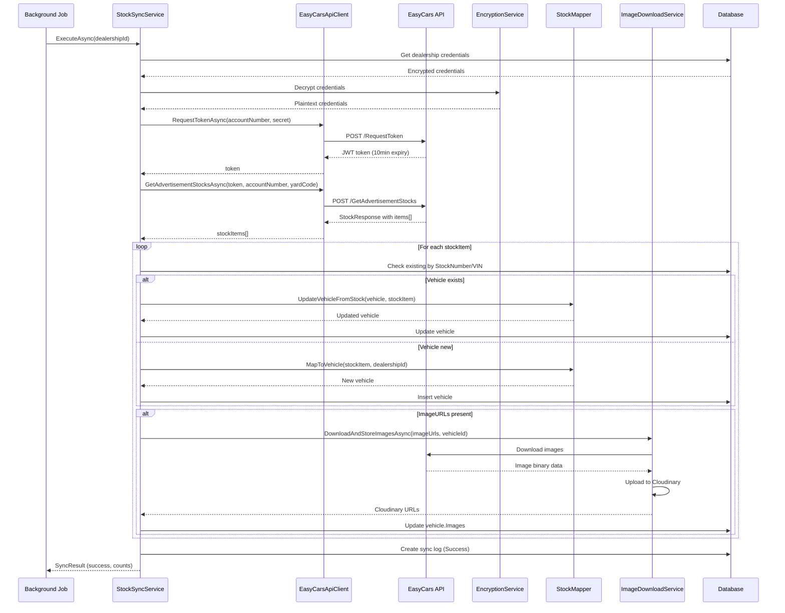
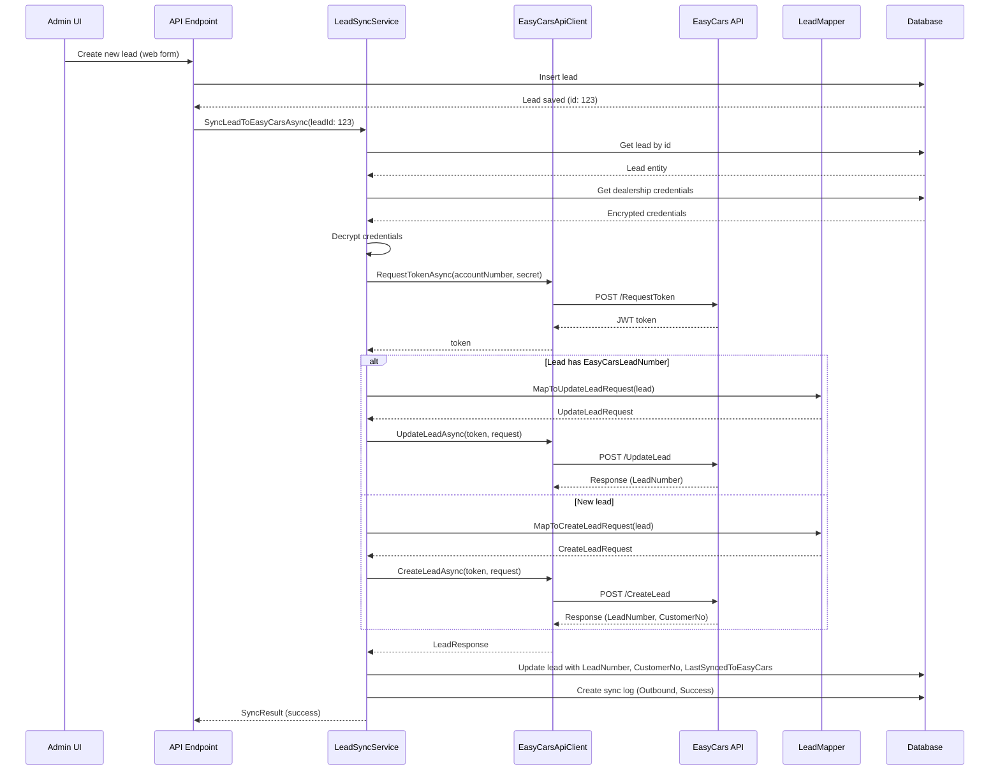
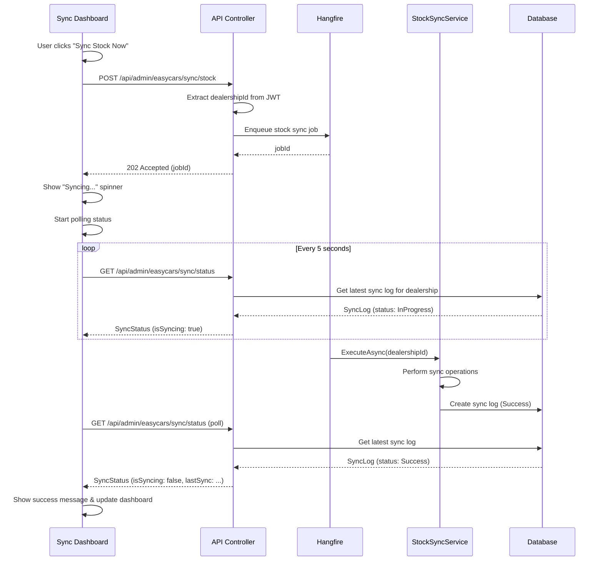

# Data Flow

### Stock Synchronization Flow (Inbound)

```mermaid
sequenceDiagram
    participant BG as Background Job
    participant SS as StockSyncService
    participant API as EasyCarsApiClient
    participant EC as EasyCars API
    participant ENC as EncryptionService
    participant MAP as StockMapper
    participant IMG as ImageDownloadService
    participant DB as Database
    
    BG->>SS: ExecuteAsync(dealershipId)
    SS->>DB: Get dealership credentials
    DB-->>SS: Encrypted credentials
    SS->>ENC: Decrypt credentials
    ENC-->>SS: Plaintext credentials
    SS->>API: RequestTokenAsync(accountNumber, secret)
    API->>EC: POST /RequestToken
    EC-->>API: JWT token (10min expiry)
    API-->>SS: token
    
    SS->>API: GetAdvertisementStocksAsync(token, accountNumber, yardCode)
    API->>EC: POST /GetAdvertisementStocks
    EC-->>API: StockResponse with items[]
    API-->>SS: stockItems[]
    
    loop For each stockItem
        SS->>DB: Check existing by StockNumber/VIN
        alt Vehicle exists
            SS->>MAP: UpdateVehicleFromStock(vehicle, stockItem)
            MAP-->>SS: Updated vehicle
            SS->>DB: Update vehicle
        else Vehicle new
            SS->>MAP: MapToVehicle(stockItem, dealershipId)
            MAP-->>SS: New vehicle
            SS->>DB: Insert vehicle
        end
        
        alt ImageURLs present
            SS->>IMG: DownloadAndStoreImagesAsync(imageUrls, vehicleId)
            IMG->>EC: Download images
            EC-->>IMG: Image binary data
            IMG->>IMG: Upload to Cloudinary
            IMG-->>SS: Cloudinary URLs
            SS->>DB: Update vehicle.Images
        end
    end
    
    SS->>DB: Create sync log (Success)
    SS-->>BG: SyncResult (success, counts)
```

---

### Lead Synchronization Flow (Outbound - Local to EasyCars)

```mermaid
sequenceDiagram
    participant UI as Admin UI
    participant API_EP as API Endpoint
    participant LS as LeadSyncService
    participant API as EasyCarsApiClient
    participant EC as EasyCars API
    participant MAP as LeadMapper
    participant DB as Database
    
    UI->>API_EP: Create new lead (web form)
    API_EP->>DB: Insert lead
    DB-->>API_EP: Lead saved (id: 123)
    API_EP->>LS: SyncLeadToEasyCarsAsync(leadId: 123)
    
    LS->>DB: Get lead by id
    DB-->>LS: Lead entity
    LS->>DB: Get dealership credentials
    DB-->>LS: Encrypted credentials
    LS->>LS: Decrypt credentials
    
    LS->>API: RequestTokenAsync(accountNumber, secret)
    API->>EC: POST /RequestToken
    EC-->>API: JWT token
    API-->>LS: token
    
    alt Lead has EasyCarsLeadNumber
        LS->>MAP: MapToUpdateLeadRequest(lead)
        MAP-->>LS: UpdateLeadRequest
        LS->>API: UpdateLeadAsync(token, request)
        API->>EC: POST /UpdateLead
        EC-->>API: Response (LeadNumber)
    else New lead
        LS->>MAP: MapToCreateLeadRequest(lead)
        MAP-->>LS: CreateLeadRequest
        LS->>API: CreateLeadAsync(token, request)
        API->>EC: POST /CreateLead
        EC-->>API: Response (LeadNumber, CustomerNo)
    end
    
    API-->>LS: LeadResponse
    LS->>DB: Update lead with LeadNumber, CustomerNo, LastSyncedToEasyCars
    LS->>DB: Create sync log (Outbound, Success)
    LS-->>API_EP: SyncResult (success)
```

---

### Manual Sync Trigger Flow

```mermaid
sequenceDiagram
    participant UI as Sync Dashboard
    participant API as API Controller
    participant HF as Hangfire
    participant SS as StockSyncService
    participant DB as Database
    
    UI->>UI: User clicks "Sync Stock Now"
    UI->>API: POST /api/admin/easycars/sync/stock
    API->>API: Extract dealershipId from JWT
    API->>HF: Enqueue stock sync job
    HF-->>API: jobId
    API-->>UI: 202 Accepted (jobId)
    UI->>UI: Show "Syncing..." spinner
    UI->>UI: Start polling status
    
    loop Every 5 seconds
        UI->>API: GET /api/admin/easycars/sync/status
        API->>DB: Get latest sync log for dealership
        DB-->>API: SyncLog (status: InProgress)
        API-->>UI: SyncStatus (isSyncing: true)
    end
    
    HF->>SS: ExecuteAsync(dealershipId)
    SS->>SS: Perform sync operations
    SS->>DB: Create sync log (Success)
    
    UI->>API: GET /api/admin/easycars/sync/status (poll)
    API->>DB: Get latest sync log
    DB-->>API: SyncLog (status: Success)
    API-->>UI: SyncStatus (isSyncing: false, lastSync: ...)
    UI->>UI: Show success message & update dashboard
```

---

