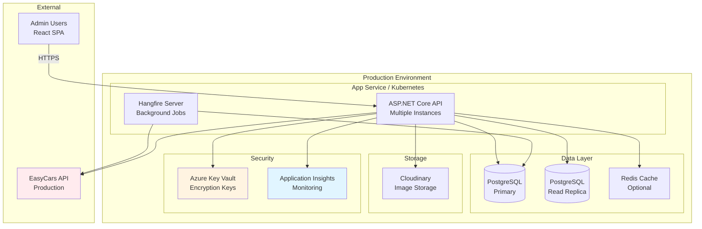

# Deployment Architecture

### Infrastructure Components



---

### Deployment Steps

1. **Database Migration:**
   ```bash
   # Staging
   dotnet ef database update --connection "Host=staging-db;..." --project JealPrototype.Infrastructure
   
   # Production (during maintenance window)
   dotnet ef database update --connection "Host=prod-db;..." --project JealPrototype.Infrastructure
   ```

2. **Backend Deployment:**
   ```bash
   # Build and publish
   dotnet publish -c Release -o ./publish
   
   # Deploy to App Service
   az webapp deployment source config-zip --resource-group jeal-rg --name jeal-api --src ./publish.zip
   ```

3. **Hangfire Configuration:**
   - Ensure Hangfire dashboard accessible at `/hangfire` with admin authentication
   - Verify background jobs registered:
     - `easycars-stock-sync` with cron schedule
     - `easycars-lead-sync` with cron schedule

4. **Frontend Deployment:**
   ```bash
   # Build React app
   npm run build
   
   # Deploy to static hosting (Azure Storage, S3, Netlify)
   az storage blob upload-batch --destination $web --source ./build
   ```

5. **Post-Deployment Verification:**
   - [ ] Health check endpoint returns 200
   - [ ] Hangfire dashboard accessible
   - [ ] Test credentials API with valid token
   - [ ] Trigger manual stock sync and verify completion
   - [ ] Check Application Insights for errors
   - [ ] Verify encryption keys retrieved from Key Vault

---

### Environment Configuration

**Development:**
```json
{
  "ConnectionStrings": {
    "DefaultConnection": "Host=localhost;Database=jeal_dev;Username=dev;Password=dev"
  },
  "JwtSettings": {
    "Secret": "dev-secret-key-min-32-chars",
    "Issuer": "JealPrototype",
    "Audience": "JealPrototype",
    "ExpirationMinutes": "1440"
  },
  "EasyCarsEncryption": {
    "MasterKey": "dev-encryption-key-32-bytes-base64=="
  },
  "EasyCarsApi": {
    "TestBaseUrl": "https://testmy.easycars.com.au",
    "ProductionBaseUrl": "https://my.easycars.net.au",
    "RequestTimeout": "30"
  },
  "EasyCarsSync": {
    "StockSyncSchedule": "0 2 * * *",
    "LeadSyncSchedule": "0 * * * *"
  },
  "Hangfire": {
    "DashboardPath": "/hangfire",
    "WorkerCount": "4"
  }
}
```

**Production (from Key Vault):**
- `EasyCarsEncryption:MasterKey` - Retrieved from Azure Key Vault secret `easycars-encryption-key`
- `ConnectionStrings:DefaultConnection` - Retrieved from Key Vault secret `db-connection-string`
- `JwtSettings:Secret` - Retrieved from Key Vault secret `jwt-secret`

---

### Monitoring & Operations

**Application Insights Dashboards:**
- **EasyCars Integration Health:** Sync success rate, API response times, error count
- **Background Jobs:** Job execution duration, job queue depth, failure rate
- **API Performance:** Request duration P50/P95/P99, requests per second

**Alerts:**
- Sync failure rate > 10% in 1 hour → Email to ops team
- API authentication failures > 5 in 10 minutes → Slack notification
- Circuit breaker opened → PagerDuty alert
- Database connection failures → Critical alert

**Logging:**
- All logs sent to Application Insights with structured logging (Serilog)
- Log levels: Debug (verbose API calls), Info (sync operations), Warning (partial failures), Error (critical failures)
- Correlation ID propagated across all operations for tracing

**Runbook:**
- **Sync Failures:** Check Hangfire dashboard for job details → Review sync log table → Verify EasyCars API status → Check credentials
- **Authentication Failures:** Verify credentials not expired → Test connection from admin UI → Check Key Vault access
- **Performance Degradation:** Check EasyCars API status → Review database query performance → Verify connection pool settings

---

