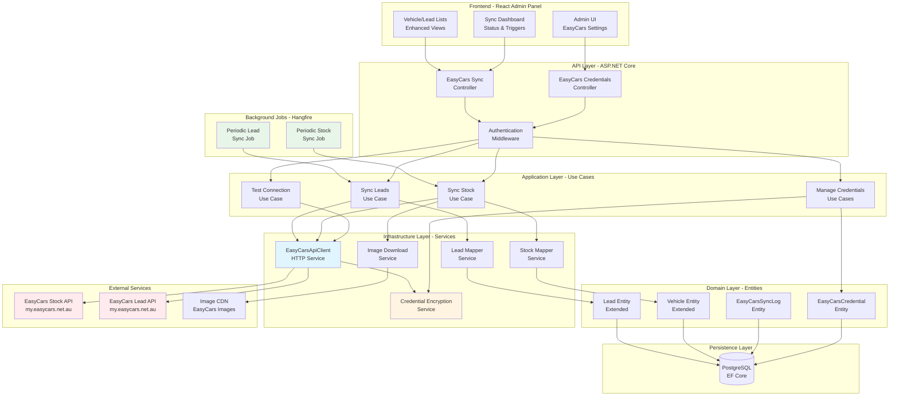

# High Level Architecture

### Technical Summary

The EasyCars API Integration extends the existing monolithic .NET 8 application with a dedicated integration layer that manages bi-directional data synchronization between dealerships and the EasyCars platform. The architecture implements a background service pattern using Hangfire for scheduled synchronization jobs, HttpClient-based services for API communication with automatic JWT token management, and encrypted credential storage using AES-256-GCM encryption. Data flows through a mapping layer that transforms between EasyCars API models and domain entities, with comprehensive audit logging and idempotent sync operations to handle failures gracefully. The frontend React admin panel provides dealership administrators with secure credential management, manual sync triggers, and real-time synchronization status monitoring. This architecture maintains backward compatibility with existing vehicle and lead management features while enabling seamless integration with EasyCars Stock API and Lead API endpoints.

### Architecture Diagram

### Architectural Patterns

The EasyCars integration follows established architectural patterns to ensure maintainability, testability, and scalability:

- **Clean Architecture (Domain-Centric):** Maintains strict dependency rules with Domain at the center, Application layer orchestrating use cases, Infrastructure implementing external concerns, and API exposing HTTP endpoints - _Rationale:_ Ensures business logic independence from infrastructure concerns and enables comprehensive testing

- **Repository Pattern:** Abstracts data access through repository interfaces defined in Application layer and implemented in Infrastructure - _Rationale:_ Provides flexibility for data access strategy changes and enables unit testing with mocked repositories

- **Background Job Pattern (Hangfire):** Executes long-running synchronization operations outside the HTTP request pipeline with persistence, retry logic, and monitoring - _Rationale:_ Prevents API timeouts, enables scheduled operations, and provides fault tolerance for sync jobs

- **API Client Service Pattern:** Encapsulates all EasyCars API communication in dedicated service classes with token management, error handling, and retry logic - _Rationale:_ Centralizes external API concerns, simplifies testing with mocked HTTP clients, and ensures consistent error handling

- **Data Mapper Pattern:** Transforms between external API models and domain entities through dedicated mapper services - _Rationale:_ Decouples domain model from external API structure, enabling independent evolution and comprehensive data validation

- **Encryption-at-Rest Pattern:** Encrypts sensitive credentials using AES-256-GCM before database storage with secure key management - _Rationale:_ Protects sensitive dealer credentials from database breaches and meets security compliance requirements

- **Audit Log Pattern:** Records all synchronization operations with timestamps, results, and error details for traceability - _Rationale:_ Enables troubleshooting, compliance auditing, and operational monitoring of integration health

- **Idempotent Operations Pattern:** Ensures sync operations can safely execute multiple times with same result - _Rationale:_ Handles retry scenarios, prevents duplicate data creation, and supports eventual consistency

---

